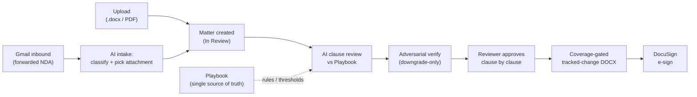

# NDA Review OS

**An AI contract desk that reviews, redlines, generates, and e-signs NDAs — clause by clause, with a human in the loop.**

*(Product name: **NDA Review OS**. Repo slug: `nda-automation`. Built for [Aspora](https://aspora.com).)*

An **NDA** (non-disclosure agreement) almost never gets signed exactly as drafted. A counterparty — the other company you're contracting with — sends one back **already redlined**: names filled in, terms changed, whole clauses inserted with Track Changes on. Someone then has to read all of it, decide what's acceptable against company policy, propose counter-edits, and get sign-off before it goes back.

Done by hand, that loop is slow and inconsistent. Positions drift between reviewers. The evidence for a decision lives in someone's head. The "final" file is whichever attachment was emailed last. And a dropped or mis-anchored redline isn't caught until *after* it's been signed. **NDA Review OS** automates that loop without taking the human out of it.

> **New here? Start with the docs, in this order:**
> 1. **[`docs/OVERVIEW.md`](docs/OVERVIEW.md)** — a one-page tour (what, why, how it works, cost). Read this first.
> 2. **[`docs/DETAILED.md`](docs/DETAILED.md)** — the full technical reference (architecture, data model, every component, config, operations, troubleshooting, rebuild-from-scratch).
>
> This README is the **front door**: it orients you and routes you to depth — it is deliberately *not* the exhaustive reference.

---

## Contents

- [What it is](#what-it-is)
- [Why it exists](#why-it-exists)
- [How it works](#how-it-works)
- [Glossary](#glossary)
- [Quick start](#quick-start)
- [The five ideas that hold it together](#the-five-ideas-that-hold-it-together)
- [How to change things](#how-to-change-things)
- [Where to go next](#where-to-go-next)
- [Configuration (the essentials)](#configuration-the-essentials)
- [Deployment](#deployment)
- [Testing](#testing)
- [Project layout](#project-layout)

---

## What it is

A single-page web app plus a small Python backend that runs the whole NDA loop:

- **Review** — an AI legal assessment of every clause against your editable **playbook** (your rulebook of acceptable clause positions), with quoted evidence and a pass / review / fail verdict per clause.
- **Redline** — proposed tracked-change edits, exported as a native Word (`.docx`) document whose changes are proven complete before it ships.
- **Generate** — draft a first-party NDA from your own signing entities and approved governing-law options (no model call — generation is deterministic).
- **E-sign** — send the approved document to **DocuSign** for real signature.

NDAs **arrive** two ways: a human uploads a `.docx`/PDF, or one is forwarded to a connected **Gmail** mailbox and imported automatically. Each becomes a **matter** — one NDA and everything the app knows about it (source document, review results, redline drafts, stage). Matters move through a fixed lifecycle: **In Review → Reviewed → Approved → Sent**.

It covers **6 core clause families** — mutuality, confidential information, governing law, term & survival, non-circumvention, and signatures — across **5 governing-law options**: India, Delaware, England & Wales, DIFC, and Ontario/Canada.

**Stack at a glance:** vanilla-JS single-page app (no build step) · Python stdlib HTTP server (no web framework) · JSON matter store on a persistent disk (no database) · AI review on **Claude Opus 4.8 via OpenRouter** · `python-docx` / PyMuPDF / pdf2docx for documents · DocuSign for e-sign · Gmail for inbound/outbound.

## Why it exists

The pain it removes, restated plainly:

- **Almost no NDA is signed as drafted** — the counterparty sends it back already redlined, and every one has to be read and re-decided.
- **Positions drift between reviewers** — the same clause gets a different answer depending on who looked at it.
- **The "final" file is whichever attachment was emailed last** — nobody is sure which version is authoritative.
- **A dropped redline isn't caught until after signing** — a change you meant to make silently doesn't make it into the executed document.

NDA Review OS makes the playbook the single source of truth, keeps every verdict grounded in quoted text, gates export on a proof that no redline was dropped, and keeps a human approval step in the middle — so the loop is fast *and* auditable.

## How it works



1. **Arrive.** An NDA is uploaded, or forwarded to the connected Gmail mailbox. On the Gmail path an AI **intake** step classifies whether the mail is really an NDA and picks the right attachment.
2. **Review.** The AI assesses each clause against the **playbook** and emits a verdict + quoted evidence + a proposed **redline** (a tracked-change edit).
3. **Verify.** An independent adversarial pass re-checks flagged clauses. It can only **downgrade** a verdict, never inflate one — and a verdict not grounded in quoted document text is rejected.
4. **Approve.** A human works the clause checklist and approves clause by clause. Nothing is exported or sent automatically.
5. **Export & sign.** The reviewed document is exported as a tracked-change Word file that passes a **coverage gate** (proof that every word of the source plus the redlines is present), then handed to **DocuSign**.

For the exhaustive mechanism — grounding contract, PDF extraction, Gmail throttle/dedup internals, the coverage gate's edge cases — see [`docs/DETAILED.md`](docs/DETAILED.md).

## Glossary

Load-bearing terms, in one place:

| Term | Meaning |
|---|---|
| **NDA** | Non-disclosure agreement — the contract this tool reviews, redlines, generates, and e-signs. |
| **Playbook** | Your editable rulebook of acceptable clause positions (`playbook.json`). The AI applies it; it is the single source of truth. |
| **Matter** | One NDA plus everything the app knows about it: source document, review results, redline drafts, and its stage in the lifecycle. |
| **Counterparty** | The other company on the NDA — the one that sent (and often already redlined) the document. |
| **Redline** | A proposed tracked-change edit to a clause, exported as native Word Track Changes. |
| **Grounded** | A verdict is only valid if it quotes the exact source text it relied on. **Fail-closed**: ungrounded *fail* verdicts are rejected and ungrounded *pass/review* verdicts are downgraded — the engine won't assert something it can't cite. |
| **Coverage gate** | A pre-export check that proves the tracked-change DOCX contains every word of the source plus the redlines, so a redline can't be silently dropped or mis-anchored. Export is *blocked* if it fails. |
| **Gen-verify gate** | An independent check on a *generated* NDA: the document is verified against its own playbook before it can be saved. |
| **Fail-closed / fail-open** | Fail-closed = when in doubt, refuse (block export, reject an ungrounded fail). Fail-open = when a non-critical helper errors, degrade gracefully instead of crashing the request. |

## Quick start

Requires **Python 3.9+**. DOCX review and export work out of the box (`python-docx` is the only core dependency). PDF and Gmail are optional extras.

```bash
# 1. Install (with optional PDF + Gmail support)
python3 -m pip install -e ".[pdf,gmail]"

# 2. Configure local credentials
cp .env.example .env          # then fill in keys; .env is gitignored
set -a; source .env; set +a

# 3. Run
python3 -m nda_automation.server --port 8787
```

Then open <http://127.0.0.1:8787>.

Minimum `.env` to turn on AI review:

```bash
NDA_AI_REVIEW_ENABLED=true
NDA_AI_PROVIDER=openrouter
NDA_AI_MODEL=x-ai/grok-4.3          # cheap local default shipped in .env.example
OPENROUTER_API_KEY="your-openrouter-api-key"
```

> **One model default, stated once.** Production runs **Claude Opus 4.8** — prod slug `anthropic/claude-opus-4.8-fast` (set in `render.yaml`, and the code default in `ai_review.DEFAULT_OPENROUTER_MODEL`). The checked-in `.env.example` ships a cheaper `x-ai/grok-4.3` for local dev, so local reviews cost less and won't behave identically to prod. To mirror prod locally, set `NDA_AI_MODEL=anthropic/claude-opus-4.8-fast`. Source of truth: `render.yaml` (prod) and `.env.example` (local).

You can also paste the OpenRouter key from **Admin → AI** after the app is running (saved keys are stored under ignored app data and never returned to the browser). Connect Gmail, Drive, and DocuSign from **Admin** after signing in with Google.

**Optional extras**

```bash
python3 -m pip install -e ".[pdf]"        # PDF intake + PDF-to-DOCX (pypdf / PyMuPDF / pdf2docx)
python3 -m pip install -e ".[gmail]"      # Gmail connector (Google API client)
python3 -m pip install -e ".[pdf,gmail]"  # both (what the Render image installs)
```

Without the `pdf` extra, PDF uploads fail with a clear "PDF support is not installed" error rather than degrading silently.

## The five ideas that hold it together

1. **The Playbook is the single source of truth.** Every rule, threshold, and approved option lives in `playbook.json`. The AI *infers, judges, and applies* from it — it never overwrites it. Hardcoded rules elsewhere are treated as bugs and removed.
2. **AI-first, adversarially verified.** A strong reviewer proposes verdicts; a second-pass verifier can only **downgrade**, never inflate. An ungrounded verdict doesn't stand.
3. **A human approval gate.** Nothing is exported or sent until a reviewer has approved it clause by clause.
4. **Faithful by construction.** The **coverage gate** proves the exported DOCX contains every word of the source plus the redlines — which is what makes counterparty-pre-redlined NDAs safe to export.
5. **Deterministic where it must be.** NDA generation uses no model call, and the playbook is protected by deterministic structural lint. The AI is used for judgment, not for things that must be exact.

## How to change things

The common "how would I actually add/fix X?" tasks, each with a one-liner and where the real recipe lives:

| I want to… | Start here | Depth |
|---|---|---|
| **Add or edit a playbook rule** | Edit it in the app: **Playbook** tab → draft → publish (schema-validated + consistency lint). The tracked file is `playbook.json`. | [`docs/DETAILED.md`](docs/DETAILED.md) · in-app **Guide** tab |
| **Add a governing-law option or signing entity** | Governing-law options are playbook-driven (Playbook tab); signing entities live in the entity registry (`entity_registry.py`). | [`docs/DETAILED.md`](docs/DETAILED.md) |
| **Change the AI model** | Set `NDA_AI_MODEL` (reviewer), or override a role from **Admin → AI** at runtime (persists to app settings, takes precedence over env). | [Configuration](#configuration-the-essentials) · [`docs/DETAILED.md`](docs/DETAILED.md) |
| **Add or change an env var** | Read it in code, declare it in `render.yaml` (prod) and document it in `.env.example` (local). | [`docs/DETAILED.md`](docs/DETAILED.md) — full config reference |
| **Run the tests** | `python3 -m pytest -q` (backend) · `npm run test:frontend` (Playwright). | [Testing](#testing) |
| **Deploy** | Merge to `main` — Render continuously deploys from it. | [Deployment](#deployment) |
| **Edit a static asset** | Edit the file under `static/`, then bump the asset manifest with `python -m nda_automation.static_versioning --write` (else browsers serve the cached file). | [Testing](#testing) |

## Where to go next

- **[`docs/OVERVIEW.md`](docs/OVERVIEW.md)** — one-page tour: what, why, how it works, and cost.
- **[`docs/DETAILED.md`](docs/DETAILED.md)** — the single source of truth for full config, architecture, data model, operations, troubleshooting, and rebuild-from-scratch.
- **`docs/SCALE_READINESS.md`** — scaling notes and the single-process limits.
- **In-app Guide tab** — a read-only walkthrough of how structure parsing, reference resolution, concept classification, deterministic validation, and AI-first assessment fit together.

**A note on cost.** AI is the only usage-based cost (billed through OpenRouter). Each AI feature is a single model call. On the default **Opus 4.8** reviewer path, clause review is ≈ **$0.18/call** and a full inbound pass (intake + triage + review + verify + structure) is ≈ **$0.20**. Routing the reviewer to **DeepSeek** instead drops a full pass to ≈ **$0.04** (per-operation review ≈ **$0.028**) at tied review quality in our own bake-offs. Generation costs **$0** (deterministic). These are estimates — the OpenRouter dashboard is the source of truth for actual spend. Full breakdown: [`docs/OVERVIEW.md`](docs/OVERVIEW.md).

## Configuration (the essentials)

Just the variables a newcomer needs to boot. **[`docs/DETAILED.md`](docs/DETAILED.md) is the single source of truth for the complete set** (Gmail throttle/dedup internals, retry limits, incident levers, and everything else) — that list is deliberately not duplicated here.

| Variable | Purpose |
|---|---|
| `NDA_DATA_DIR` | Where matters, uploads, settings, and sync state are stored (prod: `/var/data`). |
| `NDA_REQUIRE_AUTH` | `true` to require login (auto-required on non-loopback binds). |
| `NDA_GOOGLE_OAUTH_CLIENT_ID` / `_SECRET` | Google login for per-user identity (each user sees only their own matters). |
| `NDA_AI_REVIEW_ENABLED` | Turns on provider-backed AI review. |
| `OPENROUTER_API_KEY` | Server-side OpenRouter key for review, verify, intake, and Gmail attachment selection. |
| `NDA_AI_PROVIDER` / `NDA_AI_MODEL` | `openrouter` / the reviewer model (prod default `anthropic/claude-opus-4.8-fast`; local `.env.example` `x-ai/grok-4.3`). |
| `NDA_AI_VERIFIER` / `NDA_AI_VERIFIER_MODEL` | Optional adversarial verifier (default model `deepseek/deepseek-v4-pro`; reuses the OpenRouter key). |
| `NDA_GMAIL_SYNC_ENABLED` | Master on/off for the Gmail inbound poller (emergency kill switch). |
| `NDA_GMAIL_IMPORT_LIMIT` | Max inbound messages processed per poll cycle (default `20`) — keeps a first-connect backlog from OOMing the worker. |
| `NDA_ADMIN_USERS` | Comma-separated identities granted admin. |

DocuSign, Gmail, and Google OAuth also need their fixed redirect URIs configured on the provider side and mirrored into env vars — see [`docs/DETAILED.md`](docs/DETAILED.md).

## Deployment

Live production runs on **Render**, and **`main` continuously deploys**: merge to `main` and Render redeploys.

The service builds from the repo `Dockerfile` (not Render's native Python runtime) so the review faithful-source preview can install system rendering dependencies — LibreOffice for DOCX-to-PDF, fontconfig, and metric-compatible Calibri/Cambria substitutes. Without those OS packages, DOCX page-image previews and PDF exports fall back to an unavailable-state message instead of silently flattening layout.

**Storage — what's actually true today.** The checked-in `render.yaml` blueprint provisions a **Render Standard plan with a 1 GB persistent disk mounted at `/var/data`**, with `NDA_DATA_DIR=/var/data`, `NDA_USERS_PATH=/var/data/users.json`, and `NDA_EXPORTS_DIR=/var/data/exports`. Matters, sessions, and OAuth tokens are **durable** across restart and redeploy. The `NDA_ALLOW_EPHEMERAL_DATA` escape hatch has been removed, so the startup storage guard is active and refuses to boot if the data dir ever regresses to ephemeral `/tmp`.

> `docs/PERSISTENT_STORAGE.md` describes the *earlier* free-plan/`/tmp` setup and is marked **SUPERSEDED** — that migration has already been applied. Don't follow its `/tmp` steps.

Production start command (from the Dockerfile / Render):

```bash
python -m nda_automation.server --host 0.0.0.0 --port $PORT
```

- Public deployments require authentication. Non-loopback binds auto-require it; if auth is required but no login method is configured, the server refuses to start.
- Configure the OAuth redirect URIs in the Google Cloud console (`.../auth/google/callback`, `.../auth/gmail/callback`) and on the DocuSign integration key (`.../auth/docusign/callback`), with matching env vars.

## Testing

> Don't run the full backend suite casually on a shared box — it's heavy. Prefer targeted runs.

```bash
python3 -m pip install -e ".[pdf,gmail]" && python3 -m pip install pytest && npm install
```

```bash
python3 -m pytest -q                 # backend unit + eval gate
npm run test:frontend:utils          # frontend pure modules
npm run test:frontend                # real-app Playwright behavior suite
ruff check nda_automation tests      # lint
```

The Playwright suite runs the real app in Chromium (repository/matter loading, review view modes, viewer editing, redline rendering, Gmail/admin surfaces, dashboard search, DOCX export). The backend suite includes a counsel-style **eval gate** over review cases.

**Static cache-busting.** Every `<script>`/`<link>` in `static/index.html` carries a `?v=<token>` query tracked in `static/asset-tokens.json`. After editing any file under `static/`, regenerate the manifest with `python -m nda_automation.static_versioning --write` (a `--check` run, enforced in CI, verifies the tree matches). A forgotten bump leaves browsers serving the cached file.

## Project layout

```
nda_automation/            # Python backend (stdlib http.server)
├── server.py              # HTTP server, routing, auth, Gmail sync scheduler
├── routes/                # Request handlers: matters, review, generation,
│                          #   gmail, drive, playbook, admin, auth, dashboard, …
├── ai_*.py                # AI review pipeline: assessor, contract, prompt,
│                          #   verifier, first-review, grounding
├── checker.py, playbook_rules.py, prohibited_positions.py   # deterministic engine
├── contract_structure.py, reference_resolver.py, concept_classifier.py  # structure layer
├── matter_store.py, matter_repository.py, artifact_registry.py, workflow.py  # data model
├── gmail_integration.py, drive_integration.py, google_identity.py  # integrations
├── nda_generation*.py, entity_registry.py     # NDA generation + signing entities
├── docx_*.py, pdf_*.py, redline_*.py, *_export.py  # document I/O, redlines, export
├── csrf.py, rate_limit.py, http_auth.py, untrusted_text.py  # security
└── dashboard_search_intent.py, matter_summary.py, telemetry.py  # dashboard + ops
static/                    # Vanilla-JS frontend (no build step)
├── index.html, app.js, styles.css
├── js/                    # Controllers: repository, review-workstation, admin-*, …
└── js/modules/            # Pure, unit-tested ES modules
tests/                     # pytest (backend) + Playwright/.mjs (frontend)
docs/                      # START HERE: OVERVIEW.md (tour) + DETAILED.md (full reference)
playbook.json              # Tracked review policy (runtime/history are derived + gitignored)
render.yaml                # Render deployment blueprint (Standard plan + /var/data disk)
```

---

_Aspora — internal NDA review tooling. Not legal advice._
