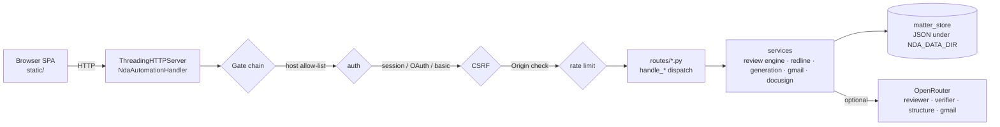

# NDA Review OS — Detailed Sheet

> Technical companion to the one-page **Overview**. Covers architecture, data model, components, configuration, operations, troubleshooting, rebuild-from-scratch, and — the heart of this sheet — **how to add, remove, and fix things** across the system. Deployment-platform access (hosting dashboard, deploy mechanics) is documented **separately** and is intentionally out of scope here. This sheet is grounded in the deployed code at `origin/main` (`d9a052f3`). It is the **canonical configuration reference** — the README trims its env table and points here for the full list.

## Table of contents

1. [Architecture](#architecture) — request flow, module map, frontend
2. [Data model](#data-model) — matter, review contract, playbook, entity registry, disk layout
3. [Components — What / Why / How](#components--what--why--how)
4. [AI model map & cost](#ai-model-map--cost)
5. [Configuration — environment variables](#configuration--environment-variables) (authoritative)
6. [Operations (day-to-day)](#operations-day-to-day)
7. [**How to change the system**](#how-to-change-the-system) — grounded recipes
8. [Troubleshooting](#troubleshooting)
9. [Rebuild from scratch](#rebuild-from-scratch)
10. [Known limitations / next](#known-limitations--next)

---

## Architecture

NDA Review OS is a single Python process that serves both the API and a static single-page app. There is no application server framework, no SQL database, and no frontend build step. State is JSON files on a durable disk; AI is reached over HTTP through OpenRouter.

### Request flow

A request lands on the stdlib HTTP server, passes a fixed gate chain, then is dispatched to a route handler that calls services, which read and write the matter store.



The server is `http.server.ThreadingHTTPServer` with a custom handler subclass `NdaAutomationHandler` in `nda_automation/server.py`. It implements `do_GET/HEAD/POST/PUT/PATCH/DELETE`, validates the `Host` header, runs auth, CSRF and rate-limit checks, then dispatches: **exact-match** route tables first (`server.py:_GET_EXACT_ROUTES` / `_POST_EXACT_ROUTES` / `_DELETE_EXACT_ROUTES`), then **path-pattern** routes (e.g. `/api/matters/<id>/review`). Static assets under `/static/*` and a small public allow-list (`_PUBLIC_GET_EXACT_ROUTES`, `_PUBLIC_POST_EXACT_ROUTES`) are served before the auth gate so the login shell, logo, and fonts load for an unauthenticated user. The CLI entrypoint is `python -m nda_automation.server` (`main()` in `server.py`, argparse flags `--host` default `127.0.0.1`, `--port` default `8787`).

**Gate order** on a state-changing request (`server.py:do_POST`): rate-limit (public-safe pre-check) → `_authorize_csrf("POST")` → route lookup → per-route auth/admin gate inside the handler. Reads (`do_GET`) run the public allow-list, then rate-limit, then the route table.

### Module map

Modules in `nda_automation/`, grouped by responsibility:

| Area | Key modules |
| --- | --- |
| Server / routing | `server.py`, `routes/*.py` (`matters`, `review`, `approval`, `playbook`, `generation`, `entities`, `gmail`, `docusign`, `drive`, `corpus`, `dashboard`, `admin`, `auth`, `send_document`, `pdf_markup`, `common`) |
| Intake & Gmail | `ingestion_service.py`, `gmail_integration.py`, `gmail_intake_classifier.py`, `gmail_attachment_selector.py`, `gmail_matter_inbox.py`, `gmail_matter_outbox.py`, `gmail_processed_ledger.py`, `triage.py` |
| Review engine + verifier + grounding | `review_engine.py`, `review_orchestration.py`, `ai_first_review.py`, `ai_assessor.py`, `ai_review.py`, `ai_verifier.py`, `evidence_grounding.py`, `review_document.py`, `checker.py`, `checks/*.py`, `concept_classifier.py`, `semantic_crosscheck.py`, `contract_structure.py`, `reference_resolver.py`, `structure_validation.py`, `review_result_contract.py`, `review_state.py`, `review_staleness.py` |
| Redline / export + coverage gate | `redline_xml.py`, `source_redline_docx.py`, `redline_export_service.py`, `docx_export.py`, `docx_health.py`, `export_service.py`, `pdf_export_service.py`, `annotated_pdf_export.py`, `redline_edit_contract.py`, `redline_actions.py` |
| PDF → DOCX | `pdf_ingest_conversion.py`, `pdf_docx_reconstruction.py`, `pdf_text.py`, `pdf_ocr.py`, `table_extraction.py` |
| Playbook + lint | `playbook_runtime.py`, `playbook_rules.py`, `playbook_policy.py`, `playbook_authoring.py`, `playbook_lint.py`, `playbook_semantic_lint.py`, `playbook_suggest_wording.py`, `checker.py` (`PLAYBOOK_PATH`, `load_playbook`) |
| Generation + entity registry | `nda_generation.py`, `nda_generation_workflow.py`, `nda_generation_ai.py`, `entity_registry.py`, `entity_store.py`, `entity_authoring.py` |
| DocuSign | `docusign_integration.py`, `docusign_workflow.py`, `docusign_connection.py` |
| Security / auth | `http_auth.py`, `csrf.py`, `rate_limit.py`, `google_identity.py`, `untrusted_text.py` |
| Storage / ops | `matter_store.py`, `matter_repository.py`, `durable_io.py`, `disk_janitor.py`, `operational_settings_repository.py`, `app_settings.py`, `user_store.py`, `artifact_registry.py`, `artifact_service.py` |
| Model wiring | `model_resolver.py` (single source of truth: role → persisted/env/default model) |
| Static asset guard | `static_versioning.py` (`--write` / `--check` manifest) |

### Frontend (`static/`)

A vanilla-JS SPA, **no build step** — the browser loads ES modules (`.mjs`) and classic scripts (`.js`) directly. `static/index.html` is the shell; every script and stylesheet tag carries a `?v=<token>` cache-bust query (e.g. `?v=20260617a401`), and token-matched requests are served `Cache-Control: immutable`, so a forgotten bump pins an already-loaded browser to the OLD bytes for a year. The tokens are tracked in the committed `static/asset-tokens.json` manifest: after editing any static file, regenerate with `python -m nda_automation.static_versioning --write` and verify with `--check` (the manifest staleness guard `tests/test_static_asset_manifest.py` and a browser-bundle **syntax floor** test both run in CI; the manifest writer refuses to record changed bytes under an unchanged token, so it can't launder a missing bump). `static/app.js` is the main controller (tab navigation, modal lifecycle, polling). The workspace tabs are **Overview**, **Repository** (kanban board of matters), **Corpus** (document library / facet search), **Playbook** (clause authoring, admin-gated), the **Review workstation**, the **Generator**, and **Admin**.

The review workstation is split across `static/js/review-workstation-*.js` (actions, source, rendering, viewer, format) with the canonical model in `static/js/modules/review-workstation-model.mjs`. `static/js/modules/global-bridge.mjs` re-exports tested module functions as globals so classic scripts call the same code the tests exercise. DOCX is rendered faithfully via vendored `jszip` + `docx-preview` (`static/vendor/`, lazy-loaded). Styling is `static/styles.css` plus `static/css/{repository,corpus,overview}.css`.

---

## Data model

There is no relational store. The unit of state is a **Matter** — a JSON document persisted under `NDA_DATA_DIR`.

### Matter

Created by `matter_store.create_matter(...)` (`matter_store.py:1322`). Core persisted fields:

| Field | Meaning |
| --- | --- |
| `id`, `created_at`, `updated_at` | identity / timestamps (`id` = `matter_<hex>`) |
| `source_type`, `source_filename`, `stored_filename`, `document_title` | provenance of the uploaded/imported doc |
| `status` | coarse outcome flag (`active`, `closed`, `approved`, …) |
| `board_column` | kanban column |
| `extracted_text` | normalized source text |
| `review_result` | the full review contract (below) |
| `triage` | triage classification block |
| `redline_draft` | human edits layered on the review |
| `intake_metadata` | nested block incl. AI-extracted `counterparty` |
| `review_status`, `review_started_at`, `review_error` | async on-demand-review lifecycle |
| `working_docx_*` | reconstructed-DOCX body for PDF-source matters |
| `gmail_*` | inbound thread / message / attachment metadata |

**Lifecycle.** `workflow.py` derives a `workflow_state` (never stored) from `status`, `board_column`, and signature markers, rolling everything into a coarse **phase** (`PHASE_*` constants). The product-facing states are **In Review → Reviewed → Approved → Sent**: review runs (on demand), a human approves (`status="approved"`, recorded by `matter_store.record_matter_approval` at `matter_store.py:732`), the reviewed/redlined doc is sent (outbound recorded), and a terminal signed state follows on DocuSign completion or a manual "mark signed".

### review_result contract

Assembled and validated by `review_result_contract.build_review_result(...)` (`review_result_contract.py:92`). Top-level keys include `review_engine_version`, `overall_status`, `review_state`, `requirements_passed/failed/needs_review`, `paragraphs`, `contract_structure`, `reference_resolver`, `concept_classifier`, `semantic_crosscheck`, `ai_review`, `ai_verifier`, `clauses`, `redline_edits`, `proposed_changes`, `counterparty`, and `evidence_trust`.

- **Per-clause** entries carry a `decision` (`pass` / `review` / `fail`), evidence, and any attached `proposed_changes`/redline edits. Counts are derived canonically from clause decisions.
- **Counterparty** is always normalized to a stable block (`name`, `confidence`, `verified`, `first_party`, `second_party`, `source`); an unextracted block defaults to `source="unreviewed"` so provenance never implies an AI named the party when it didn't.
- **Provenance is enforced**: `build_review_result` runs `validate_clause_evidence_trust` (from `review_document.py`); if a clause's cited evidence can't be aligned to the source text it raises `EvidenceProvenanceError` rather than ship an ungrounded verdict. On success it stamps `evidence_trust = {"status": "verified", "errors": []}`.

### playbook.json

The single source of truth for review rules. The runtime path is `checker.PLAYBOOK_PATH` (`checker.py:100`), resolved by `_resolve_playbook_path()` (`checker.py:67`): a **copy under `NDA_DATA_DIR`** when present (its `.runtime` / `.draft` / `.history` siblings live there too), else the bundled `checker.BUNDLED_PLAYBOOK_PATH` (`checker.py:64`, repo-root `playbook.json`), which is copied to the durable path on first use. Top-level: `version`, `name`, and `clauses[]`. The six shipped clause families are `mutuality`, `confidential_information`, `governing_law`, `term_and_survival`, `non_circumvention`, and `signatures`.

Each clause carries display fields (`name`, `requirement`, `preferred_position`, `redline_template`, `search_terms`, `semantic_signals`, `rationale`, `evidence_guidance`) and a structured `rules` block: `clause_type`, `acceptable_position`, `pass_conditions[]`, `fail_conditions[]`, `review_triggers[]`, `evidence_requirements`, `redline_guidance`. Each condition is `{id, decision, issue_type, description, redline_action}`. `governing_law.rules` additionally holds `approved_options[]` — the five approved jurisdictions (India, Delaware, England & Wales, DIFC, Ontario/Canada), which double as the governing-law options the generator and entity registry join against.

**Native vs dynamic clauses.** Each clause declares an `engine` marker (`playbook_rules.py:202`): `CLAUSE_ENGINE_NATIVE` (`"native"`, the default, backed by a Python checker in `checks/*`) or `CLAUSE_ENGINE_DYNAMIC` (`"dynamic"`, playbook-only, reviewed by the AI engine — the deterministic engine never emits it). `non_circumvention` was migrated to a pure dynamic clause as the tracer (`playbook_rules.py:207`). Schema validation splits on the marker: `_validate_native_clause_schema` (`playbook_rules.py:1004`) rejects an unknown clause id that isn't marked dynamic; `_validate_dynamic_clause_schema` (`playbook_rules.py:1023`) rejects redefining a native id as dynamic. A dynamic clause may carry extra fields including `prohibited_position_patterns` (surfaced to the AI packet by `playbook_rules._prohibited_patterns_for_ai`, `playbook_rules.py:157`).

### Signing-entity registry

`entity_registry.py` defines Aspora's signing entities as self-contained bundles (legal name, short name, address, signatory, `incorporation_jurisdiction`, `jurisdiction` venue, and `governing_law`). Each bundle's `governing_law.playbook_option_id` is the **join key** into the live playbook's `governing_law.rules.approved_options[].id` — picking an entity selects the matching approved governing law, so registry and playbook can't silently drift (`entity_registry.validate_registry_against_playbook()` guards this). The **seven** shipped entities (governing law in parentheses) are Aspora Technology Services Private Limited (India), Vance Money Services LLC (Delaware), Real Transfer Limited (England & Wales), Vance Techlabs Limited (DIFC), Nesse Technologies Inc (Ontario, Canada), Vance Technologies Limited (England & Wales), and Aspora Financial Services (IFSC) Private Limited (India). The live store lives under `NDA_DATA_DIR` (`entity_store.py`), seeded from the bundles; `entity_authoring.py` is the edit path.

### Where it persists (under `NDA_DATA_DIR`)

| Path | Contents |
| --- | --- |
| `matters.json` | matter index |
| `matters/<id>.json` | per-matter records |
| `uploads/<id>-<file>` | original source documents |
| artifacts (via `artifact_registry`) | generated/reviewed/signed document bytes |
| `app_settings.json` (+ `.lock`) | operational settings, integration config, persisted admins |
| `users.json` (or `NDA_USERS_PATH`) | sessions / login state |
| `gmail_inbound_cursors.json` | per-user Gmail catch-up cursor |
| `pruned-matters/` (+ `pruned-matters/uploads/`) | archived records + source docs the disk janitor rotates before deletion |
| `playbook.json` (+ `.runtime`/`.draft`/`.history`) | live playbook copy when present |

All writes go through `durable_io.py` (tmp-file + `fsync` + atomic `os.replace` + directory fsync); `matters.json` is guarded by an in-process `RLock` plus a cross-process `flock`.

`list_matters` (hit by the board poll, the notifications poll, and dashboard search) is served from a **per-record incremental cache** (`matter_store`): a matter's own write patches its entry in place rather than reloading the whole index, and the cache is invalidated on any foreign change (`NDA_DISABLE_MATTER_LIST_CACHE` forces the uncached path). The append-only `matter_timeline` is **capped at 500 events** (`TIMELINE_MAX_EVENTS`, newest kept, with a `timeline_truncated` marker that accumulates `dropped_count`) so a long-lived matter can't bloat every store read; the full timeline is carried in the **detail** payload but **dropped from the LIST payload** (`matter_view` pops `matter_timeline`).

**Disk janitor.** `disk_janitor.py` reclaims `/var/data` by rotating `pruned-matters/` (retention-pruned + bulk-archived matters). `run_archive_rotation()` (`disk_janitor.py:297`) only ever touches `pruned-matters/` (never live records, `users.json`, or the playbook), is `..`-escape-proof, keeps the newest `NDA_ARCHIVE_KEEP_MIN` (default 20) archives, drops archives older than `NDA_ARCHIVE_RETENTION_DAYS` (default 30) or over the size cap `NDA_ARCHIVE_MAX_BYTES` (default 250 MB), and prunes **aggressively** to the size cap when disk usage crosses `NDA_DISK_HIGH_WATERMARK_PCT` (default 85%). It self-throttles to at most once per `NDA_ARCHIVE_ROTATION_MIN_INTERVAL_SECONDS` (default 3600).

---

## Components — What / Why / How

**Intake / Gmail classifier + attachment selector** (`ingestion_service.py`, `gmail_integration.py`, `gmail_intake_classifier.py`, `gmail_attachment_selector.py`, `triage.py`)
*What:* imports NDAs from manual upload or Gmail and classifies them. *Why:* inbound mail is noisy and was once the source of a review-cost storm, so intake is decoupled from review. *How:* `create_matter_from_document()` ingests **without** auto-reviewing (review is on-demand). The Gmail **intake classifier** (DeepSeek-Flash) judges each attachment NDA / UNCERTAIN / NOT_NDA; the **attachment selector** (DeepSeek-Pro triage) picks which attachment in a message is the NDA. Both neutralize untrusted text (`untrusted_text.py`) against prompt injection and **fail safe**: on missing key / timeout / error they return `not_configured`/`error` and the caller falls back to deterministic handling. Prohibited-clause hits (e.g. `non_circumvention`) route to legal review.

The Gmail inbound path (`gmail_integration.py`, `gmail_matter_inbox.py`, `gmail_processed_ledger.py`) adds four precision/robustness layers, each env-gated: **sender-domain excludes** for e-signature-platform + calendar-invite senders (default on, `NDA_GMAIL_ENVELOPE_EXCLUDES`) applied both as an authoritative code-level check — drops stay visible in `skipped[]` + the processed ledger and catch forwarded notifications — and as redundant `-from:` query clauses; an **AI pre-gate** (default on, `NDA_GMAIL_AI_PREGATE`) that withholds the paid Flash-intake and Pro-selector calls from candidates the deterministic scorer terminally skips, with mandatory fail-open exemptions (explicit NDA mention in subject/body/snippet or a strong NDA filename; and extraction-blind attachments — `< 200` chars of text: image-only DOCX, partial-scan PDF, foreign-language NDA); **executed-NDA capture** (default on, `NDA_GMAIL_ESIGN_NDA_CAPTURE`) that routes a platform notification carrying an explicit NDA signal through intake clamped to the triage lane with `triage_reason=esign_notification_nda` provenance instead of terminally dropping it (the completion email is often the only copy of an executed NDA); and **reason-stratified quarantine** — environmental failures retry up to `NDA_GMAIL_TRANSIENT_RETRY_LIMIT` (default 5), deterministic-permanent skips (too-large, scanned-needs-OCR) quarantine early at `NDA_GMAIL_PERMANENT_SKIP_RETRY_LIMIT` (default 2) with the underlying reason + filename recorded so a human can OCR/resize/requeue. A newly connected account's first sync is backfill-capped (`NDA_GMAIL_FIRST_SYNC_CAP_DAYS`, default 14) and widens per successful poll.

**Detection floor.** Inbound NDA detection uses a hardcoded **keyword floor** — a fixed, built-in vocabulary of NDA signals baked into the code and applied by the deterministic **content** scorer only, never added to the Gmail fetch query (broadening the fetch is the inbox-storm vector) and never triggering synchronous review. The floor is not admin-editable; the Admin → Gmail tab surfaces the resolved signal-term vocabulary read-only ("NDA signal terms").

**Review engine** (`review_engine.py`, `review_orchestration.py`, `ai_first_review.py`, `ai_assessor.py`, `checker.py`, `checks/*.py`)
*What:* produces per-clause verdicts with evidence. *Why:* every export and approval depends on a trustworthy, grounded verdict. *How:* `review_nda_with_active_engine()` selects the engine via `NDA_ACTIVE_REVIEW_ENGINE` (default `ai_first`). The deterministic `checks/*` registry (native clauses, pure functions, no network) builds structure and a first-pass signal; the AI-first path sends one packet (playbook + paragraphs + structure) to **Claude Opus** over OpenRouter (`ai_review.DEFAULT_OPENROUTER_MODEL = anthropic/claude-opus-4.8-fast`, env `NDA_AI_MODEL`, gated by `NDA_AI_REVIEW_ENABLED`) and returns a decision/evidence/redline per clause. For `term_and_survival` the packet carries the numeric cap as a machine-explicit field — `{"limit": 5, "unit": "years", "limit_months": 60, "direction": "max", "inclusive": true}` (`playbook_rules._clause_threshold_for_ai`) — so a weaker model comparing a term stated in months reads the 60-month equivalence directly instead of re-deriving it; Review surfaces the same figure. **New review-result metadata** is added in the review-engine metadata layer `review_engine._with_active_engine_metadata` (`review_engine.py:141`), NOT in a checker — see the recipe below.

**Adversarial verifier** (`ai_verifier.py`)
*What:* a second opinion that challenges the reviewer. *Why:* catches over-confident passes and polarity traps without letting a second model become the sole judge. *How:* runs **DeepSeek-V4-Pro** (`ai_verifier.DEFAULT_VERIFIER_MODEL = deepseek/deepseek-v4-pro`, env `NDA_AI_VERIFIER_MODEL`, timeout `NDA_AI_VERIFIER_TIMEOUT_SECONDS` default 30s) over escalated / low-confidence findings. Gated by `NDA_AI_VERIFIER` (**code default off**; **prod turns it ON** via `render.yaml`); a refute downgrades a verdict to `review` rather than acquitting to `pass`. True no-op when disabled. **Fail-open on total batch failure** — see [Known limitations](#known-limitations--next).

**Evidence grounding** (`evidence_grounding.py`, `review_document.py`)
*What:* enforces that every finding is anchored to real source text. *Why:* an ungrounded verdict is a liability. *How:* classifies findings as grounded / legitimate-absence / ungrounded; ungrounded findings are downgraded to `review`. The contract rejects un-alignable evidence with `EvidenceProvenanceError`.

**Structure validation** (`structure_validation.py`)
*What:* an AI overlay that prunes false-positive "sections" from the deterministic parse. *Why:* signature lines, addresses, and definition sentences can masquerade as headings and corrupt cross-reference resolution. *How:* **DeepSeek-Flash** (env `NDA_STRUCTURE_VALIDATION_MODEL`), gated by `NDA_STRUCTURE_VALIDATION_ENABLED` (**code default off**; prod ON). It only demotes false positives (never deletes paragraphs); failures leave the deterministic structure untouched (fail-safe), and results are cached by content hash.

**Redline build + coverage gate** (`redline_xml.py`, `source_redline_docx.py`, `docx_health.py`, `docx_export.py`)
*What:* emits a tracked-change Word file and guarantees it contains all the source content. *Why:* a redline that silently drops a source clause is a P0 integrity failure (PDF-source exports historically did this). *How:* `redline_xml.py` builds WordprocessingML `<w:ins>`/`<w:del>` markup against the original DOCX; `docx_health.verify_export_content_coverage()` is the **coverage gate** — it checks the exported text against the source (ratio floor `EXPORT_CONTENT_COVERAGE_RATIO`, plus a paragraph-sequence check) and blocks the export if they diverge. The client-facing **"integrity check failed"** message is counts-only (never leaks document content); details are logged server-side. Provenance uses `paragraph_index`/`index` (the unique per-block key) not `source_index` (non-unique — split blocks share it): see [Coverage / export internals](#recipe-coverage--export-internals).

**PDF → DOCX** (`pdf_ingest_conversion.py`, `pdf_docx_reconstruction.py`, `pdf_text.py`, `pdf_ocr.py`, `table_extraction.py`)
*What:* converts a PDF matter into a reconstructed DOCX once at ingest, then treats it like any DOCX. *Why:* a single text engine avoids anchor mismatches and lets PDF redlines export as real tracked changes. *How:* text via `pypdf`, reconstruction via `pdf2docx` in a bounded subprocess (concurrency `NDA_PDF_DOCX_MAX_CONCURRENCY`, timeout `NDA_PDF_DOCX_TIMEOUT_SECONDS`, LRU cache, mem/CPU limits). Requires the `[pdf]` extra. **OCR** (`pdf_ocr.py`, gemini-2.5-flash via OpenRouter) is gated by `NDA_PDF_OCR_ENABLED` (**default off**); **table augmentation** (`camelot`, `[tables]` extra) is gated by `NDA_TABLE_AUGMENTATION_ENABLED` (**code default off**; prod OFF, keyword-gated when ON). While reconstruction is in flight the PDF source/render routes return a **503 retry** (queue-wait `NDA_PDF_DOCX_QUEUE_WAIT_SECONDS`) so the client polls rather than fails.

**Playbook draft/publish + 3-layer lint** (`playbook_authoring.py`, `playbook_lint.py`, `playbook_semantic_lint.py`, `playbook_runtime.py`)
*What:* edit, validate, and publish the playbook. *Why:* the playbook is the source of truth, so a malformed publish must be impossible. *How:* **Layer 1** (`playbook_lint.py`) is a deterministic structural lint (decision-space, well-formed conditions, redline templates, approved options, referential integrity) that **hard-blocks** publish on failure (and fails open only if the lint itself throws). **Layer 2** (`playbook_semantic_lint.py`) is an **advisory** AI prose-vs-rules check (Opus, env `NDA_PLAYBOOK_SEMANTIC_LINT_MODEL`), gated by `NDA_PLAYBOOK_SEMANTIC_LINT_ENABLED` (**code default off**; prod ON), warnings only. Layer 3 (full semantic enforcement) is not built. `playbook_runtime.py` owns persistence/locking/hashing and the draft/publish state machine.

**Deterministic generation + gen-verify** (`nda_generation.py`, `nda_generation_workflow.py`, `entity_registry.py`)
*What:* generates a first-party NDA from a signing entity + the playbook. *Why:* a generated NDA must be playbook-compliant by construction, with no model in the critical path. *How:* fills the bundled `templates/generic_nda.docx` (`nda_generation.TEMPLATE_PATH`, `nda_generation.py:53`) deterministically; the playbook owns substantive wording (term cap + survival, CI exclusion), the template owns boilerplate/`[...]` slots. The term is entered as **years or months** (`draft-intake.js`/`.mjs` unit selector); `_resolve_term_months` clamps a months figure to `[1, max_term_years * 12]` (the months cap is derived from the years cap — 60 months == 5 years, no separate playbook field), and `_align_term_and_survival` writes "for a fixed period of {N months | N years} … **whichever is earlier**". An **optional** AI clause-adapter (`nda_generation_ai.py`, DeepSeek-Flash, env `NDA_GENERATION_AI_ENABLED`, **prod OFF**) only rephrases already-compliant text under a `GuardedClauseAdapter`. `generate_and_save_nda()` (`nda_generation.py:924`) runs a self-check against the playbook (gen-verify) before persisting; the governing-law check is **override-aware** — it validates the user-chosen approved law (`governing_law_option_id` / `governing_law_overridden` / `entity_default_governing_law_value`, `nda_generation.py:450`), not just the entity default.

**DocuSign e-sign** (`docusign_integration.py`, `docusign_workflow.py`, `docusign_connection.py`)
*What:* sends the finalized NDA for signature and tracks execution. *Why:* closes the loop from review to a signed document, and must never sign the un-redlined original or a stale reviewed copy. *How:* real OAuth (authorization-code grant); `_resolve_signable_document` (`docusign_workflow.py:523`) enforces the P0 invariant — a matter WITH reviewer edits **rebuilds** the reviewed DOCX from its *current* state through the same coverage-gated, staleness-checked `build_reviewed_docx` path used by download/approval, and any failure **raises** (`ReviewedDocumentUnavailableError`, `docusign_workflow.py:108`) rather than falling back to the original; a matter with NO edits walks the artifact precedence (reviewed → generated → sent → original, but never trusting a lingering role=reviewed artifact when current decisions yield no edits). The reviewed artifact is also registered **eagerly at approval** (`routes/approval._preflight_reviewed_artifact`, content-hash idempotent) so approval and send agree on the exact bytes. The workflow then plants per-party anchor tabs (`signHere`/`dateSigned`) for the counterparty and a single Aspora signer (parallel routing by default; `signing_order:"sequential"` to sequence), creates/sends the envelope, and on completion downloads the executed PDF as the signed artifact. Optional Connect webhook is HMAC-verified when `NDA_DOCUSIGN_CONNECT_HMAC_KEY` is set.

**Security / anti-abuse** (`http_auth.py`, `csrf.py`, `rate_limit.py`, `untrusted_text.py`, `matter_store.py`)
*What:* authentication, admin gating, CSRF, rate limiting, tenant isolation, injection neutralization. *Why:* the app handles confidential third-party documents and privileged actions. *How:* see [Security seams](#recipe-security-seams-add-a-guard-or-tighten-one) and the auth notes in [Troubleshooting](#troubleshooting).

---

## AI model map & cost

All AI is reached through OpenRouter using `OPENROUTER_API_KEY`. The effective model per role is resolved by `model_resolver.resolve_model(role)` (`model_resolver.py:184`) with precedence **persisted admin pick → (reviewer legacy) → env var → built-in default** (roles enumerated in `model_resolver.ROLES`, `model_resolver.py:36`). Generation is deterministic by default.

| Feature / role | Env knob (model) | Built-in default model | Prod value (`render.yaml`) | AI or deterministic |
| --- | --- | --- | --- | --- |
| Reviewer | `NDA_AI_MODEL` | `anthropic/claude-opus-4.8-fast` | `anthropic/claude-opus-4.8-fast` | AI |
| Adversarial verifier | `NDA_AI_VERIFIER_MODEL` | `deepseek/deepseek-v4-pro` | on, DeepSeek-Pro | AI (prod on) |
| Structure validation | `NDA_STRUCTURE_VALIDATION_MODEL` | `deepseek/deepseek-v4-flash` | on, DeepSeek-Flash | AI (prod on) |
| Playbook semantic lint | `NDA_PLAYBOOK_SEMANTIC_LINT_MODEL` | reviewer default (Opus) | on, `anthropic/claude-opus-4.8` | AI, advisory (prod on) |
| NDA generation | (deterministic) | — | deterministic | **Deterministic** |
| Generation clause-adapter | `NDA_GENERATION_MODEL` | `deepseek/deepseek-v4-flash` | model set, **`NDA_GENERATION_AI_ENABLED=false`** | AI, optional polish (prod OFF) |
| Gmail attachment triage | `NDA_GMAIL_TRIAGE_MODEL` | `deepseek/deepseek-v4-pro` | DeepSeek-Pro | AI |
| Gmail intake classifier | `NDA_GMAIL_INTAKE_MODEL` | `deepseek/deepseek-v4-flash` | DeepSeek-Flash | AI |
| PDF OCR | `NDA_PDF_OCR_MODEL` | `google/gemini-2.5-flash` | default off | AI (off) |
| Dashboard assistant | `NDA_DASHBOARD_ASSISTANT_MODEL` | reviewer default | `anthropic/claude-opus-4.8-fast` | AI |
| Search intent | `NDA_SEARCH_INTENT_MODEL` | reviewer default | `anthropic/claude-opus-4.8-fast` | AI |
| Matter summary | `NDA_MATTER_SUMMARY_MODEL` | reviewer default | `anthropic/claude-opus-4.8-fast` | AI |

**Local vs prod divergence:** `.env.example` ships `NDA_AI_MODEL=x-ai/grok-4.3` as the local reviewer default; prod runs Claude Opus 4.8. Local reviews will therefore NOT behave identically to prod — override `NDA_AI_MODEL` to the prod model to mirror it.

### Cost (consistent with the Overview)

Every AI feature is a **single model call**. The app logs Opus at **$5/M input, $25/M output**; OpenRouter's dashboard is the source of truth for actual spend.

| Figure | Value |
| --- | --- |
| Per-clause-review call, **Opus default** | **≈ $0.18** (15k in / 4k out) |
| Per-operation review, **DeepSeek-routed** | **≈ $0.028** |
| One inbound NDA, **full pass on Opus** | **≈ $0.20** (intake + triage + review + verify + structure) |
| One inbound NDA, **full pass DeepSeek-routed** | **≈ $0.04** |
| NDA generation | **$0** (deterministic) |

The reviewer is the only expensive call and the only one on Opus by default; verifier / structure / intake / triage already run on cheap DeepSeek/Flash models. Our own bake-offs found DeepSeek-V4-Pro and GLM 5.2 tie Opus on review quality at ~1/8 the cost — routing the reviewer there is what drops a full pass from ~$0.20 to ~$0.04.

---

## Configuration — environment variables

**This is the authoritative env reference.** Names and purpose only. **Secret = yes** means the value is a credential — never commit or paste it; set via the environment or, where supported, the in-app Admin panel (stored under ignored app data, never returned to the browser). Prod values (where fixed) are in `render.yaml`; secrets there are `sync: false` (dashboard-set).

### Storage & durability

| Variable | Purpose | Default | Secret |
| --- | --- | --- | --- |
| `NDA_DATA_DIR` | root for all persisted state | `./data` (prod `/var/data`) | no |
| `NDA_EXPORTS_DIR` | persisted export downloads | under data dir | no |
| `NDA_USERS_PATH` | session/user store path | `<data>/users.json` | no |
| `NDA_ALLOW_EPHEMERAL_DATA` | permit a non-durable data dir (testing/demo only; prod removes it so the storage guard is active) | off | no |
| `NDA_MATTER_RETENTION_LIMIT` | max retained matters before oldest evicted (`matter_store.DEFAULT_MAX_STORED_MATTERS` = 250) | 250 | no |
| `NDA_DISABLE_MATTER_LIST_CACHE` | force the uncached `list_matters` path | off | no |

### Disk janitor (archive rotation)

| Variable | Purpose | Default | Secret |
| --- | --- | --- | --- |
| `NDA_ARCHIVE_MAX_BYTES` | size cap on `pruned-matters/` | 250 MB | no |
| `NDA_ARCHIVE_RETENTION_DAYS` | max age of an archived matter | 30 | no |
| `NDA_ARCHIVE_KEEP_MIN` | never prune below this many newest archives | 20 | no |
| `NDA_DISK_HIGH_WATERMARK_PCT` | disk-usage % that triggers aggressive prune to cap | 85 | no |
| `NDA_ARCHIVE_ROTATION_MIN_INTERVAL_SECONDS` | min seconds between rotations | 3600 | no |

### AI — reviewer & roles

| Variable | Purpose | Default | Secret |
| --- | --- | --- | --- |
| `OPENROUTER_API_KEY` | OpenRouter key for all AI roles | unset | **yes** |
| `NDA_AI_REVIEW_ENABLED` | enable provider-backed review | off (prod on) | no |
| `NDA_AI_PROVIDER` / `NDA_AI_MODEL` | reviewer provider / model | openrouter / Opus 4.8 (local `.env.example`: Grok) | no |
| `NDA_AI_TIMEOUT_SECONDS` | reviewer call timeout | 180 (prod) | no |
| `NDA_AI_REVIEW_THRESHOLD` | confidence below which a verdict demotes to review (`DEFAULT_AI_REVIEW_THRESHOLD` = 0.75) | 0.75 | no |
| `NDA_AI_REVIEW_CLAUSES` | restrict AI review to a clause subset (niche) | all | no |
| `NDA_ACTIVE_REVIEW_ENGINE` | engine selector | `ai_first` | no |
| `NDA_AI_VERIFIER` / `NDA_AI_VERIFIER_MODEL` / `NDA_AI_VERIFIER_TIMEOUT_SECONDS` | adversarial verifier toggle / model / timeout | off (prod on) / DeepSeek-Pro / 30 | no |
| `NDA_STRUCTURE_VALIDATION_ENABLED` / `NDA_STRUCTURE_VALIDATION_MODEL` | structure overlay toggle / model | off (prod on) / DeepSeek-Flash | no |
| `NDA_PLAYBOOK_SEMANTIC_LINT_ENABLED` / `NDA_PLAYBOOK_SEMANTIC_LINT_MODEL` | Layer-2 semantic lint toggle / model | off (prod on) / Opus | no |
| `NDA_GENERATION_AI_ENABLED` / `NDA_GENERATION_MODEL` | optional generation clause-adapter toggle / model | off (prod off) / DeepSeek-Flash | no |
| `NDA_GENERATION_ADAPT_BUDGET_SECONDS` / `NDA_GENERATION_PROVIDER_SORT` | clause-adapt wall-clock budget / OpenRouter upstream routing hint | code default / prod `latency` | no |
| `NDA_GMAIL_TRIAGE_MODEL` / `NDA_GMAIL_INTAKE_MODEL` | Gmail triage / intake models | DeepSeek-Pro / DeepSeek-Flash | no |
| `NDA_PDF_OCR_ENABLED` / `NDA_PDF_OCR_MODEL` / `NDA_PDF_OCR_DPI` / `NDA_PDF_OCR_MAX_PAGES` / `NDA_PDF_OCR_TIMEOUT_SECONDS` | OCR toggle / model / tuning | off / gemini-2.5-flash / 200 / 20 / 60 | no |
| `NDA_TABLE_AUGMENTATION_ENABLED` | camelot table extraction (keyword-gated) | off | no |
| `NDA_DASHBOARD_ASSISTANT_MODEL` / `NDA_SEARCH_INTENT_MODEL` / `NDA_MATTER_SUMMARY_MODEL` | per-role model overrides | reviewer default | no |

### Auth, admin & security

| Variable | Purpose | Default | Secret |
| --- | --- | --- | --- |
| `NDA_REQUIRE_AUTH` | force login (auto on non-loopback) | off (prod on) | no |
| `NDA_ALLOWED_HOSTS` | allowed `Host` header values | unset | no |
| `NDA_ADMIN_USERS` | admin allow-list (`google:<sub>` or Basic username — **not** the Google email) | empty | no (identifiers) |
| `NDA_AUTH_USERNAME` / `NDA_AUTH_PASSWORD` | optional HTTP Basic break-glass credential | unset | **yes** (password) |
| `NDA_GOOGLE_OAUTH_CLIENT_ID` / `_SECRET` / `_REDIRECT_URI` | Google login OAuth | unset | **yes** (secret) |
| `NDA_ALLOWED_EMAIL_DOMAINS` / `NDA_ALLOWED_EMAILS` | app-layer Google sign-in allowlist (domain list / exact-email list); **both unset ⇒ OFF and every verified Google identity allowed** (fail-safe open), either set ⇒ fail-closed; Google identities only | both unset (OFF) | no (identifiers) |
| `NDA_ENFORCE_CSRF` | enable Origin/Referer CSRF check on writes | off (prod on) | no |
| `NDA_TRUSTED_PROXY_COUNT` | trusted reverse-proxy hops for real client IP | 0 (prod 1) | no |
| `NDA_RATE_LIMIT_PER_MINUTE` / `NDA_RATE_LIMIT_WINDOW_SECONDS` / `NDA_RENDER_GET_RATE_LIMIT_PER_MINUTE` | request caps (`0` disables) | 0 local / 120 prod | no |

### Gmail intake

| Variable | Purpose | Default | Secret |
| --- | --- | --- | --- |
| `NDA_GMAIL_OAUTH_REDIRECT_URI` / `NDA_GMAIL_INBOUND_TOKEN_PATH` / `NDA_GMAIL_OUTBOUND_TOKEN_PATH` | Gmail OAuth redirect / token paths | unset / `./data/gmail/*.json` | path (token files secret) |
| `NDA_GMAIL_SYNC_ENABLED` | master poller kill-switch (checked before settings; any falsey hard-stops) | on | no |
| `NDA_GMAIL_IMPORT_LIMIT` | per-user messages imported per poll | 20 | no |
| `NDA_GMAIL_TOTAL_IMPORT_LIMIT` | cross-user per-poll ceiling (single-user clamp = 40) | 40 | no |
| `NDA_GMAIL_ENVELOPE_EXCLUDES` | drop e-sign-platform + calendar-invite senders (code + `-from:` query); `0`/`false` = full rollback | **on** | no |
| `NDA_GMAIL_ESIGN_NDA_CAPTURE` | capture explicit-NDA platform notifications (`esign_notification_nda` provenance) | **on** | no |
| `NDA_GMAIL_AI_PREGATE` | deterministic pre-gate on paid intake/selector calls; fail-open for extraction-blind / foreign-language / explicitly-announced NDAs | **on** | no |
| `NDA_GMAIL_FIRST_SYNC_CAP_DAYS` | new-account first-sync backfill cap (widens per poll); `0` disables | 14 | no |
| `NDA_GMAIL_TRANSIENT_RETRY_LIMIT` / `NDA_GMAIL_PERMANENT_SKIP_RETRY_LIMIT` | quarantine retry budgets (environmental / deterministic-permanent) | 5 / 2 | no |
| `NDA_GMAIL_SYNC_YIELD_MS` | per-heavy-unit GIL yield so sync doesn't starve request threads (cap 1000ms; `<=0` off) | 50 | no |

### On-demand review pool

| Variable | Purpose | Default | Secret |
| --- | --- | --- | --- |
| `NDA_INBOUND_REVIEW_CONCURRENCY` | on-demand review worker-pool size (anti-storm serialization; `ingestion_service`) | 2 code / 1 prod | no |
| `NDA_INBOUND_REVIEW_MAX_FAILURES` | per-matter review failure cap before recovery sweep gives up (poison-pill guard) | 3 | no |
| `NDA_INBOUND_REVIEW_DEFER_BACKOFF_SECONDS` | backoff before re-enqueuing a generation-deferred review | 0.25 | no |
| `NDA_REVIEW_JOB_DEADLINE_SECONDS` | review-job wall-clock deadline | 300 | no |

### PDF → DOCX subprocess

| Variable | Purpose | Default | Secret |
| --- | --- | --- | --- |
| `NDA_PDF_DOCX_MAX_CONCURRENCY` / `_TIMEOUT_SECONDS` / `_QUEUE_WAIT_SECONDS` / `_MAX_PAGES` / `_MEMORY_LIMIT_BYTES` / `_CPU_LIMIT_SECONDS` / `_CACHE_ENTRIES` | PDF→DOCX subprocess bounds | code defaults | no |

### DocuSign & Drive

| Variable | Purpose | Default | Secret |
| --- | --- | --- | --- |
| `NDA_DOCUSIGN_CLIENT_ID` / `NDA_DOCUSIGN_CLIENT_SECRET` | DocuSign integration key + secret | unset | **yes** (secret) |
| `NDA_DOCUSIGN_OAUTH_REDIRECT_URI` / `NDA_DOCUSIGN_AUTH_SERVER` / `NDA_DOCUSIGN_TOKEN_PATH` | DocuSign OAuth redirect / `demo`\|`production` / token path | `demo` | no |
| `NDA_DOCUSIGN_CONNECT_HMAC_KEY` | webhook HMAC secret (verify Connect callback) | unset | **yes** |
| `NDA_DOCUSIGN_ASPORA_SIGNER_NAME` / `_EMAIL` | the single Aspora signer (both set ⇒ Aspora is a routable signer) | from registry | no |
| `NDA_DRIVE_OAUTH_REDIRECT_URI` / `NDA_DRIVE_TOKEN_PATH` | Google Drive OAuth | unset | path (token file secret) |

### Observability & logging

| Variable | Purpose | Default | Secret |
| --- | --- | --- | --- |
| `NDA_VERBOSE_BACKGROUND_ERRORS` | background-error logs add a 200-char message (default: class name only, PII-safe) | off | no |
| `NDA_TELEMETRY_SNAPSHOT_TICKS` | cadence (scheduler ticks, ≈ hourly) of the stdout `telemetry_snapshot` line; `<=0` disables | 120 | no |

Additional niche model/timeout/threshold knobs exist; the names above cover the operationally relevant set.

---

## Operations (day-to-day)

**Run locally**

```bash
python3 -m pip install -e ".[pdf,gmail]"      # add ,tables for camelot table extraction
cp .env.example .env                           # fill in keys; .env is gitignored
set -a; source .env; set +a
python3 -m nda_automation.server --port 8787
# open http://127.0.0.1:8787
```

DOCX review/export work with only the core dependency (`python-docx`); PDF and Gmail need their extras. Minimum AI env: `NDA_AI_REVIEW_ENABLED=true`, `NDA_AI_PROVIDER=openrouter`, `NDA_AI_MODEL`, `OPENROUTER_API_KEY`. The OpenRouter key can also be saved from **Admin → AI** after the app is running.

**Review workflow.** Import a matter (upload / Repository / Gmail), open it in the Review workstation, click **Review** to run the engine on demand, work the clause checklist (evidence, rationale, per-clause reviewed toggles, in-viewer tracked edits), then export the reviewed DOCX or send it. Inbound NDAs land **Not Reviewed** by design — review is an explicit action.

**Back up / bulk-archive matters (admin).** `GET /api/matters/export` dumps matter metadata + a stored-document manifest (no embedded source bytes); `?owner=<id>` scopes it to one user and `?owner=__all__` is the admin-only all-owners disaster-recovery dump. `POST /api/admin/matters/bulk-archive` clears auto-imported Gmail noise for an **explicit** owner + ISO time window: `dry_run` defaults true, and an execute needs `dry_run:false` plus a `confirm` equal to the server-recomputed sha256 selection hash (a stale hash → 409 with the fresh one); only `predicate ∩ confirmed` is archived, records + source docs are copied to `pruned-matters/` before deletion, deleted message ids are marked in the processed ledger to prevent re-import, and execute refuses unless inbound Gmail import is disabled (409 otherwise, `polling_paused_verified` on success). The disk janitor then rotates `pruned-matters/` (see [Data model](#disk-janitor-archive-rotation)).

**Observability.** Failures that used to be silent now emit greppable stdout: `ai_verifier_error` JSON lines per verifier failure, `logger.warning` on DocuSign send/webhook and Drive auto-intake errors, and a periodic `telemetry_snapshot` counters/gauges line (cadence `NDA_TELEMETRY_SNAPSHOT_TICKS`, ≈ hourly; counters only, no user data). The corpus index loads **off the request thread** and returns a `duplicate_scan {pending, complete}` honesty block.

**Incident levers** (flip from the hosting dashboard, no redeploy): `NDA_GMAIL_SYNC_ENABLED=false` hard-stops all Gmail polling (the global kill-switch); blank `OPENROUTER_API_KEY` disables all AI (fail-safe deterministic/`not_configured`); `NDA_INBOUND_REVIEW_CONCURRENCY` bounds review parallelism; `NDA_MATTER_RETENTION_LIMIT` and the `NDA_ARCHIVE_*` janitor knobs manage disk pressure. On a full disk, the last-seen bookkeeping save is **fail-soft** (`user_store`) so a full disk can't 500 an authenticated request.

**Tests.**

```bash
python -m pytest tests/            # backend (pytest) — DO NOT run the full suite in parallel on a shared box
npm run test:frontend              # main review-workstation FE test (Node, no build)
PYTHON=python3 node tests/frontend/review-workstation.cjs   # the runner honours $PYTHON (default python3)
# plus per-area FE scripts in package.json: test:frontend:utils, :structure, :corpus,
# :repository, :docusign, :entities, :find-replace, :docx-faithful, ... (many per-area scripts)
```

Frontend tests are plain Node scripts (`.cjs`/`.mjs`) under `tests/frontend/`; the workstation test spins up a local server (random port, so a busy port can flake) via `$PYTHON`. See the [Testing recipe](#recipe-testing-run-them-correctly) for the gotchas.

---

## How to change the system

Grounded, step-by-step recipes. Each names the exact files/functions/seams and the end-to-end layers a change touches. **The golden rules:** the playbook is the single source of truth (encode rules there, not in code — hardcodes that diverge are "deterministic ghosts"); gate every build → verify → ship incrementally; and any `static/` edit needs the cache-bust ritual.

### Recipe: add / edit a Playbook rule

The playbook is the single source of truth (`checker.PLAYBOOK_PATH`). **Never** hardcode a rule value in Python that duplicates the playbook.

1. **Edit via the Playbook tab** (admin-gated) — this drives the draft/publish state machine in `playbook_runtime.py` (persistence, locking, hashing). Add/adjust `pass_conditions[]` / `fail_conditions[]` / `review_triggers[]` (each `{id, decision, issue_type, description, redline_action}`), thresholds, `redline_template`, `search_terms`, `semantic_signals`.
2. **Draft validation → Layer-1 lint** (`playbook_lint.py`): decision-space, well-formed conditions, redline templates, approved options, referential integrity. This **hard-blocks** publish on failure (fails open only if the lint itself throws). Fix any Layer-1 error before publish.
3. **Layer-2 advisory** (`playbook_semantic_lint.py`, Opus, `NDA_PLAYBOOK_SEMANTIC_LINT_ENABLED`, prod on): prose-vs-rules warnings only; they never block. Layer 3 is unbuilt.
4. **Publish** writes the new playbook atomically and bumps `version`/hash. Downstream review provenance **locks** against that hash (`playbook_version` on the review result), so a stale review is detectable.
5. **Gotchas:** the CI playbook-lint check asserts the *live* playbook is clean — a hand-edited `playbook.json` that skips the publish gate can fail it. For `term_and_survival`, the AI-facing threshold is derived by `playbook_rules._clause_threshold_for_ai` (months == years×12); there is no separate months field.

### Recipe: add a clause type (native vs dynamic)

Decide the engine first — this is the fork:

- **Dynamic clause** (recommended for new families): set `engine: "dynamic"` (`playbook_rules.CLAUSE_ENGINE_DYNAMIC`). It lives **entirely in the playbook** and is reviewed by the **AI engine** — the deterministic `checks/*` registry never emits it (dynamic clauses *require* the AI engine; a deterministic-only run won't produce a verdict for them). Validate the shape against `_validate_dynamic_clause_schema` (`playbook_rules.py:1023`): it accepts the dynamic-only fields (e.g. `prohibited_position_patterns`, surfaced to the AI packet by `_prohibited_patterns_for_ai`) and **rejects** reusing a native clause id. This is the path `non_circumvention` took as the tracer (`playbook_rules.py:207`). The FE flags it with an "AI-reviewed" badge (`.playbook-row-dynamic`; see `tests/frontend/add-clause.cjs`).
- **Native clause**: requires a matching Python checker in `checks/*` (pure function, no network) *and* the clause id in the native set — `_validate_native_clause_schema` (`playbook_rules.py:1004`) rejects an unknown id that isn't marked dynamic. Only take this path when you're adding a deterministic oracle in code.

New review-result fields the clause needs go through the **review-engine metadata layer**, not the checker — see the next recipe.

### Recipe: add a review-result field

Add engine-carried metadata in the **review-engine metadata seam** `review_engine._with_active_engine_metadata` (`review_engine.py:141`), which every engine path funnels through — **not** in a `checks/*` checker.

- Pass the field via `review_result_contract.build_review_result`'s engine-agnostic parameters `metadata_fields` / `review_fields` / `result_fields` (`review_result_contract.py:107`) so every engine path emits it uniformly (`result.update(...)` at lines 117/133/141).
- Only add to a `checks/*` checker when the field is a genuine **clause-evaluation signal** (a native oracle output).
- Anything **evidence-bearing** must satisfy `validate_clause_evidence_trust` (`review_document.py`, run inside `build_review_result` at `review_result_contract.py:151`) or it raises `EvidenceProvenanceError`. Don't attach un-alignable evidence.

### Recipe: add a governing-law option

1. **Playbook:** add the jurisdiction to `governing_law.rules.approved_options[]` (id + display) and publish (Layer-1 lint checks approved options).
2. **Entity join:** any signing-entity bundle that should use it sets `governing_law.playbook_option_id` = the new option id. `entity_registry.validate_registry_against_playbook()` fails if a bundle points at a non-existent option.
3. **Gen-verify override-aware check:** generation validates the *chosen* law, not just the entity default — `generate_and_save_nda` records `governing_law_option_id` / `governing_law_overridden` / `entity_default_governing_law_value` (`nda_generation.py:450`) and the self-check (`nda_generation.py:924`) validates against the INTENDED law. A user-picked override that IS an approved option passes; a non-approved one is rejected (the override id is extracted by `governing_law_override_from_payload` (`nda_generation_workflow.py:248`) and validated against the playbook's approved options inside the `nda_generation.py` gen-verify path).

### Recipe: add a signing entity

1. **Registry bundle** in `entity_registry.py`: `legal_name`, `short_name`, `address`, `signatory`, `incorporation_jurisdiction`, `jurisdiction` (venue), and a `governing_law` block whose `playbook_option_id` matches an existing playbook approved option. `validate_registry_against_playbook()` enforces the join.
2. **Live store:** `entity_store.py` seeds from the bundles under `NDA_DATA_DIR`; edit through `entity_authoring.py` / Admin → Entities.
3. **Generation slots:** the entity fills the `templates/generic_nda.docx` slots deterministically (`nda_generation.TEMPLATE_PATH`, `nda_generation.py:53`). The template owns boilerplate + `[...]` slots; the playbook owns the substantive clause positions (term cap + survival, CI exclusions, `non_circumvention`). Adaptation is constrained to slots, never substance.
4. **DocuSign signer:** the per-entity registry signatory has no email, so Aspora's copy is routed by the single default signer `NDA_DOCUSIGN_ASPORA_SIGNER_NAME`/`_EMAIL` (set both to make Aspora a routable signer).

### Recipe: change or add an AI model

All roles resolve through `model_resolver.resolve_model(role)` (`model_resolver.py:184`), precedence **persisted admin pick → reviewer-legacy → env var → built-in default**. The role registry is `_role_registry()` (`model_resolver.py:89`); built-in defaults live on the owning module (e.g. `ai_review.DEFAULT_OPENROUTER_MODEL`, `ai_verifier.DEFAULT_VERIFIER_MODEL`, `gmail_intake_classifier.DEFAULT_GMAIL_INTAKE_MODEL`).

- **Change a model at runtime:** set the role's env var (see the [model map](#ai-model-map--cost) for the knob per role) OR use the in-app model picker (persists to the `ai_models` settings section — takes precedence over env).
- **Add a new role:** add a `RoleSpec` to `_role_registry()` with its env var + default, then read it via `resolve_model("<role>")` at the call site. `role_model_overview()` (`model_resolver.py:337`) surfaces it to the Admin models UI.
- **Local vs prod divergence:** `.env.example` reviewer default is Grok; prod (`render.yaml`) is Opus. To mirror prod locally, set `NDA_AI_MODEL=anthropic/claude-opus-4.8-fast`.

### Recipe: add a format property (format toolbar)

A new character/paragraph format property (like font size) touches multiple layers — front to back:

1. **FE control** in `static/js/review-workstation-format.js` (e.g. `fontSizeSelect.onchange → applyFontSizeChange`, ~L298), which mutates the paragraph model (`paragraph.fontSize`, add/delete on the model object).
2. **FE model** — the canonical model in `static/js/modules/review-workstation-model.mjs` (paragraph-level overrides like alignment/font/fontSize).
3. **Redline emit** in `redline_xml.py`: character-level runs carry `{text, bold?, italic?, font?, size?}` (`redline_xml.py:51`); a tracked paragraph-format change emits a `<w:pPrChange>` (`_apply_tracked_paragraph_format`, `redline_xml.py:89`). Respect **CT_RPr element ordering** — Word requires run-property children in schema order; a new property has a fixed position in `<w:rPr>`.
4. **Cache-bust ritual** for every edited `static/` file (below).
5. **Gotcha:** font-size is a *template* property in the redline; adding a new one means threading it through the run tuple AND the clean-export path (the CLEAN export must keep the paragraph's formatting — `redline_xml.py:55`).

### Recipe: add an API endpoint

Routes live in `nda_automation/routes/*.py`, wired into the dispatch tables in `server.py`.

1. **Handler:** add `handle_*` in the right `routes/<area>.py` (or a new module). Read/parse via the `handler` helpers (`handler._send_json(...)`, payload parsing in `routes/common.py`).
2. **Register the route:** exact-match GET/POST/DELETE go in `server.py:_GET_EXACT_ROUTES` / `_POST_EXACT_ROUTES` / `_DELETE_EXACT_ROUTES`; path-pattern routes (with an `<id>`) go in the pattern dispatch. Public (pre-auth) routes go in `_PUBLIC_GET_EXACT_ROUTES` / `_PUBLIC_POST_EXACT_ROUTES` — use sparingly.
3. **Gates are automatic for the standard tables:** writes pass `_authorize_csrf` (`server.py:1108`) and `_rate_limit_request` (`server.py:1121`) before dispatch. Add the **admin gate inside the handler** with `http_auth.request_is_admin(user_id=..., provider=..., host=..., email=...)` (`http_auth.py:20`) for admin-only endpoints, and return 403 on failure.
4. **Tenant isolation:** scope any matter read/write to the caller's owner id; go through `matter_store` owner-matching (`_matter_owner_matches`) so the fail-closed ownerless guard applies (`matter_store.py:253`) — an empty owner is a single-tenant convenience, **not** an export/authz wildcard.
5. **Outbound guard:** any send endpoint must confirm the recipient — `routes/gmail.py:460` requires `confirm_recipient` to match the resolved address (400 before any Gmail call), which blocks spoofed-Reply-To exfiltration.

### Recipe: Gmail intake tuning

- **Detection floor is always on** (hardcoded keywords) and feeds the deterministic **content scorer only**, never the fetch query — broadening the fetch query is the inbox-storm vector and is deliberately not exposed. The floor is not admin-editable; Admin → Gmail shows the resolved vocabulary read-only.
- **AI pre-gate** (`NDA_GMAIL_AI_PREGATE`, on): withholds paid Flash-intake/Pro-selector from no-signal candidates, with fail-open exemptions (explicit NDA mention, strong filename, extraction-blind attachments). Turn off to restore always-call.
- **Sender excludes** (`NDA_GMAIL_ENVELOPE_EXCLUDES`, on) and **executed-NDA capture** (`NDA_GMAIL_ESIGN_NDA_CAPTURE`, on) tune the e-sign-platform notification handling.
- **Live vs inert today:** the intake classifier (Flash) and attachment selector (Pro) are live; detection is byte-for-byte the hardcoded keyword floor (no admin-editable term list). Inbound auto-review does not exist — review is on-demand only.

### Recipe: the static-asset cache-bust ritual

Immutable caching means an edited `.css`/`.js` is invisible to a loaded browser until its `?v=` token bumps.

1. Bump the `?v=<token>` on the changed `<script>`/`<link>` in `static/index.html` **and** on any `.js`/`.mjs` `import` that references it.
2. Regenerate the manifest: `python -m nda_automation.static_versioning --write`. Verify: `python -m nda_automation.static_versioning --check` (`static_versioning.py:185`, `MANIFEST_NAME = asset-tokens.json`).
3. The manifest writer **refuses to record changed bytes under an unchanged token**, so it can't launder a missing bump; CI runs `--check` (`test_static_asset_manifest.py`) plus a browser-bundle syntax-floor test.
4. `.html` guides are manifest-excluded, but their `?v=` in `app.js`/`index.html` must still bump if you change them.

### Recipe: coverage / export internals

- **Content-coverage gate:** `docx_health.verify_export_content_coverage()` compares exported tracked-change text to the source (ratio floor `EXPORT_CONTENT_COVERAGE_RATIO` + paragraph-sequence check) and **blocks** a divergent export. Client message is counts-only; the diverging index is logged server-side (`docx_health.py:294`).
- **`source_index` vs `paragraph_index`/`index`:** `source_index` is **non-unique provenance** — split blocks share it. The **unique per-block key** for export coverage and health is `paragraph_index`/`index` (`docx_health.py` fills a `source_index` from a `paragraph_id`, `docx_health.py:832`). When adding coverage logic, key off `paragraph_index`, never `source_index`.
- **PDF-source NDAs:** converted once to a reconstructed DOCX at ingest (`pdf_docx_reconstruction.py`), then export runs the same DOCX redline + coverage path — so PDF redlines export as real tracked changes and get the same gate DOCX-source NDAs get.
- **Don't weaken the gate to make an export pass** — fix the redline. Two residual false-fail shapes remain (see [Known limitations](#known-limitations--next)).

### Recipe: security seams (add a guard or tighten one)

- **Admin gate:** `http_auth.request_is_admin` (`http_auth.py:20`); identity is `google:<sub>` or Basic username in `NDA_ADMIN_USERS` (never the Google email).
- **CSRF Origin check:** `csrf.origin_allowed_for_request` (`csrf.py:17`) — same-site Origin/Referer on state-changing methods, enforced by `_authorize_csrf` when `NDA_ENFORCE_CSRF` is on. Safe (read-only) methods are exempt.
- **Proxy-aware rate limit:** `rate_limit._real_client_ip` (`rate_limit.py:79`) trusts exactly `NDA_TRUSTED_PROXY_COUNT` rightmost `X-Forwarded-For` hops (X-Forwarded-For is spoofable, so it's trusted only behind a known proxy count); `_rate_limit_client_key` keys per user/IP.
- **Fail-closed tenant isolation:** `matter_store._matter_owner_matches` — an empty owner is a single-tenant convenience, not an export wildcard; exports/reads route through it so an ownerless matter can't leak cross-tenant (`matter_store.py:253`).
- **Outbound recipient confirmation:** `routes/gmail.py:460` — `confirm_recipient` must equal the resolved address (400 before send).
- **Untrusted-text neutralization:** `untrusted_text.py` wraps any counterparty/document text fed to an LLM (intake classifier, attachment selector) against prompt injection; the attachment selector also has a candidate-id **intersection backstop**.

### Recipe: testing (run them correctly)

- **Backend:** `python -m pytest tests/`. **Do NOT run the full suite in parallel on the shared box** — parallel full-suites gridlock it. Run targeted files/paths.
- **Frontend:** plain Node, no build. `npm run test:frontend` (main workstation test) plus per-area scripts in `package.json`. The runner honours `$PYTHON` (default `python3`, `tests/frontend/review-workstation.cjs:19`) and binds a **random port** (a busy port can flake). Per-worktree `node_modules` may be symlinked.
- **PLAYBOOK_PATH default-arg gotcha:** patching the module constant `checker.PLAYBOOK_PATH` in a test **won't** redirect helpers that captured it as a default argument at import time. Inject explicit paths/runtimes into the functions under test instead of monkeypatching the constant.
- **Don't weaken a gate to pass a test** — the coverage gate and the playbook Layer-1 lint are correctness gates; fix the input, not the gate.

### Recipe: ops / incident levers

- **`NDA_DATA_DIR`** is the durability root; on Render it's `/var/data` (the persistent disk). The startup storage guard refuses to boot on an ephemeral path in prod.
- **Disk pressure:** the `disk_janitor.run_archive_rotation()` rotation (`NDA_ARCHIVE_MAX_BYTES` / `_RETENTION_DAYS` / `_KEEP_MIN` / `NDA_DISK_HIGH_WATERMARK_PCT`). A full disk is **fail-soft** for the last-seen session save (`user_store`) so auth doesn't 500.
- **Global Gmail stop:** `NDA_GMAIL_SYNC_ENABLED=false` (checked before settings; hard-stop).
- **Kill all AI:** blank `OPENROUTER_API_KEY` — every AI path fails safe to deterministic/`not_configured`.
- **Ship incrementally:** each finished fix goes to `main` as done (continuous deploy), not batched behind one slow branch.

### Recipe: rebuild from scratch — see the dedicated section below.

---

## Troubleshooting

| Symptom | Cause | Fix |
| --- | --- | --- |
| Board / matter list shows **"string did not match the expected pattern"** | The browser hit a `401` on an API route (session expired / unauthenticated) and a fetch site tried `response.json()` on a non-JSON 401 body | Re-sign in. The hardened path (`static/js/auth-expired.js` `parseOkJson`) checks `response.ok` first and fires the auth-expired prompt; ensure fetch sites route through it |
| Reviewed-DOCX export rejected with **"integrity check failed" / coverage** | `docx_health.verify_export_content_coverage()` found the exported tracked-change file doesn't cover the source | The safety gate working — re-run review / regenerate the redline; check server logs for the divergence detail (client message is counts-only). Don't weaken the gate |
| Static edit doesn't appear in the browser | Asset served from cache against the old `?v=` token | Bump the `?v=<token>` on the changed `<script>`/`<link>` (index.html + any `.mjs` import), then `python -m nda_automation.static_versioning --write` |
| PDF-source matter returns **503** on source/render | PDF→DOCX reconstruction in flight or no concurrency slot within the queue-wait window | Retry — the client should poll; tune `NDA_PDF_DOCX_MAX_CONCURRENCY` / `_QUEUE_WAIT_SECONDS` if it persists |
| "PDF support is not installed" | The `[pdf]` extra isn't installed | `pip install -e ".[pdf]"` |
| AI review silently does nothing / falls back deterministic | No `OPENROUTER_API_KEY`, or `NDA_AI_REVIEW_ENABLED` unset | Set the key (env or Admin → AI) and enable review |
| Admin features 403 / not visible | Caller isn't in the admin allow-list | Add the identity to `NDA_ADMIN_USERS` (`google:<sub>`, NOT the email) or grant via Admin → Access |
| Gmail import slow / throttled | Per-poll import limit / sync window clamps | Tune `NDA_GMAIL_IMPORT_LIMIT` / `NDA_GMAIL_TOTAL_IMPORT_LIMIT` (clamped server-side to protect the Gmail quota) |
| Generated NDA names the wrong jurisdiction | Entity bundle's `playbook_option_id` drifted from the playbook | Realign the bundle to an existing `governing_law` approved option (`validate_registry_against_playbook`) |
| Auth requests 500 on a full disk | Historically the last-seen bookkeeping save failed the request | Fixed — the save is now fail-soft (`user_store`); reclaim disk via the janitor / bump the Render disk |
| CI playbook-lint fails | The live `playbook.json` isn't Layer-1 clean (hand-edited past the publish gate) | Re-run through the Playbook publish flow so Layer-1 lint passes |
| Test patches `PLAYBOOK_PATH` but helpers use the old path | Helpers captured the constant as a default arg at import | Inject explicit paths/runtimes into the function under test |

---

## Rebuild from scratch

1. **Clone** the repo; Python 3.9+ (prod pins 3.11.9).
2. **Install** with the extras you need: `pip install -e ".[pdf,gmail]"` (add `,tables` for camelot).
3. **Provide the playbook**: the bundled `playbook.json` (`checker.BUNDLED_PLAYBOOK_PATH`) is the seed; it's copied under `NDA_DATA_DIR` at runtime and becomes the single source of truth. Edit only through the publish gate.
4. **Provide the entity registry**: `entity_registry.py` seeds the live store under `NDA_DATA_DIR`; ensure each bundle's `governing_law.playbook_option_id` matches a playbook approved option (`validate_registry_against_playbook`).
5. **Set required env (by name)**: `NDA_DATA_DIR` (durable path — the storage guard refuses an ephemeral path in prod), and for AI: `OPENROUTER_API_KEY`, `NDA_AI_REVIEW_ENABLED`, `NDA_AI_PROVIDER`, `NDA_AI_MODEL`. For multi-user: `NDA_REQUIRE_AUTH`, `NDA_ALLOWED_HOSTS`, `NDA_GOOGLE_OAUTH_CLIENT_ID`/`_SECRET`/`_REDIRECT_URI`, `NDA_ADMIN_USERS`. Harden behind a proxy with `NDA_ENFORCE_CSRF` and `NDA_TRUSTED_PROXY_COUNT`. Optional integrations: `NDA_GMAIL_*`, `NDA_DRIVE_*`, `NDA_DOCUSIGN_*` (names only — fill values from your own credentials).
6. **Run**: `python -m nda_automation.server --port <port>`. The server creates the data-dir layout on first boot; there is **no database to provision** — restoring state is copying the JSON tree under `NDA_DATA_DIR` (matters, uploads, artifacts, `app_settings.json`, `users.json`) onto the durable disk.
7. **Verify**: run targeted `python -m pytest tests/...` and the `npm run test:frontend*` suites (not the full suite in parallel on a shared box); smoke a DOCX upload → Review → reviewed-DOCX export.

---

## Known limitations / next

- **Reviewed-DOCX coverage-gate false-fails (2 residual shapes).** The gate is deliberately conservative and currently over-rejects: (1) a blank-line break **inside** a tracked change, and (2) text boxes / shapes the normalizer doesn't see. These are safe false-rejections (it blocks rather than ships a bad doc), queued for a targeted fix.
- **Verifier fail-open on a total batch failure (STILL OPEN).** When the batched verifier call fails outright (`verdicts_by_id is None`), `_apply_batch_verdicts` defaults every clause to `affirm` — it leaves the reviewer's findings untouched rather than downgrading. A silently dead verifier (bad slug, provider outage) does not block or downgrade anything; it degrades to "reviewer alone". Known fail-open, not fixed.
- **Playbook semantic lint (Layer 2) is advisory**; full semantic enforcement (Layer 3) is not built. Layer 1 structural lint is the only hard publish gate.
- **Optional AI overlays are code-default-off** (`NDA_AI_VERIFIER`, `NDA_STRUCTURE_VALIDATION_ENABLED`, `NDA_PLAYBOOK_SEMANTIC_LINT_ENABLED`); they cost latency and are opt-in. **Prod turns all three ON** via `render.yaml`. The generation AI clause-adapter is off in prod (`NDA_GENERATION_AI_ENABLED=false`) after it caused slow/timeout generates — generation runs the pure deterministic path.
- **OCR and table augmentation are off by default** and depend on optional extras; without `[pdf]` PDF intake is unavailable, and without `[tables]` table augmentation no-ops.
- **Single-process, JSON-on-disk store.** Durability rests entirely on a durable `NDA_DATA_DIR`; there's no SQL layer, multi-node coordination, or external queue. The on-demand review pool is an in-process, bounded worker set.
- **Single worker — inherent in the entrypoint.** `python -m nda_automation.server` runs one stdlib-`http.server` process (no gunicorn/uvicorn pool, no `WEB_CONCURRENCY`). A CPU-heavy stretch (a large sync, a cold corpus/store load) can saturate that worker and stall or 502 concurrent requests. `NDA_GMAIL_SYNC_YIELD_MS`, the off-request corpus load, and the incremental list cache mitigate specific instances, but single-worker CPU-saturation is a residual limit. The path off it (DB + object storage + Redis, EKS multi-replica) is in `docs/SCALE_READINESS.md`.
