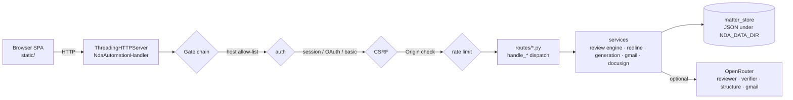

# NDA Review OS — Detailed Sheet

> Technical companion to the one-page **Overview**. Covers architecture, data model, components, configuration, operations, and how to rebuild and change the system. Deployment-platform access (hosting dashboard, deploy mechanics) is documented **separately** and is intentionally out of scope here. This sheet is grounded in the deployed code at `origin/main` (`cb7346b0`).

---

## Architecture

NDA Review OS is a single Python process that serves both the API and a static single-page app. There is no application server framework, no SQL database, and no frontend build step. State is JSON files on a durable disk; AI is reached over HTTP through OpenRouter.

### Request flow

A request lands on the stdlib HTTP server, passes a fixed gate chain, then is dispatched to a route handler that calls services, which read and write the matter store.



The server is `http.server.ThreadingHTTPServer` with a custom `SimpleHTTPRequestHandler` subclass in `nda_automation/server.py`. It implements `do_GET/HEAD/POST/PUT/PATCH/DELETE`, validates the `Host` header, runs auth, CSRF and rate-limit checks, then dispatches: exact-match route tables first, then path-pattern routes (e.g. `/api/matters/<id>/review`). Static assets under `/static/*` are served before the auth gate so the login shell, logo, and fonts load for an unauthenticated user. The CLI entrypoint is `python -m nda_automation.server` (`main()` in `server.py`, argparse flags `--host` default `127.0.0.1`, `--port` default `8787`).

### Module map

Modules in `nda_automation/`, grouped by responsibility:

| Area | Key modules |
| --- | --- |
| Server / routing | `server.py`, `routes/*.py` (`matters`, `review`, `approval`, `playbook`, `generation`, `entities`, `gmail`, `docusign`, `drive`, `corpus`, `dashboard`, `admin`, `auth`, `send_document`, `pdf_markup`, `common`) |
| Intake & Gmail | `ingestion_service.py`, `gmail_integration.py`, `gmail_intake_classifier.py`, `gmail_attachment_selector.py`, `gmail_matter_inbox.py`, `gmail_matter_outbox.py`, `gmail_processed_ledger.py`, `triage.py` |
| Review engine + verifier + grounding | `review_engine.py`, `review_orchestration.py`, `ai_first_review.py`, `ai_assessor.py`, `ai_review.py`, `ai_verifier.py`, `evidence_grounding.py`, `review_document.py`, `checker.py`, `checks/*.py`, `concept_classifier.py`, `semantic_crosscheck.py`, `contract_structure.py`, `reference_resolver.py`, `structure_validation.py`, `review_result_contract.py`, `review_state.py`, `review_staleness.py` |
| Redline / export + coverage gate | `redline_xml.py`, `source_redline_docx.py`, `redline_export_service.py`, `docx_export.py`, `docx_health.py`, `export_service.py`, `pdf_export_service.py`, `annotated_pdf_export.py`, `redline_edit_contract.py`, `redline_actions.py` |
| PDF → DOCX | `pdf_ingest_conversion.py`, `pdf_docx_reconstruction.py`, `pdf_text.py`, `pdf_ocr.py`, `table_extraction.py` |
| Playbook + lint | `playbook_runtime.py`, `playbook_rules.py`, `playbook_policy.py`, `playbook_authoring.py`, `playbook_lint.py`, `playbook_semantic_lint.py`, `playbook_suggest_wording.py` |
| Generation + entity registry | `nda_generation.py`, `nda_generation_workflow.py`, `nda_generation_ai.py`, `entity_registry.py`, `entity_store.py`, `entity_authoring.py` |
| DocuSign | `docusign_integration.py`, `docusign_workflow.py`, `docusign_connection.py` |
| Security / auth | `http_auth.py`, `csrf.py`, `rate_limit.py`, `google_identity.py`, `untrusted_text.py` |
| Storage | `matter_store.py`, `matter_repository.py`, `durable_io.py`, `operational_settings_repository.py`, `app_settings.py`, `user_store.py`, `artifact_registry.py`, `artifact_service.py` |
| Model wiring | `model_resolver.py` (single source of truth: role → persisted/env/default model) |

### Frontend (`static/`)

A vanilla-JS SPA, **no build step** — the browser loads ES modules (`.mjs`) and classic scripts (`.js`) directly. `static/index.html` is the shell; every script and stylesheet tag carries a `?v=<token>` cache-bust query (e.g. `?v=20260617a401`), and token-matched requests are served `Cache-Control: immutable`, so a forgotten bump pins an already-loaded browser to the OLD bytes for a year. The tokens are tracked in the committed `static/asset-tokens.json` manifest: after editing any static file, regenerate with `python -m nda_automation.static_versioning --write` and verify with `--check` (the manifest staleness guard `tests/test_static_asset_manifest.py` and a browser-bundle **syntax floor** test both run in CI; the manifest writer refuses to record changed bytes under an unchanged token, so it can't launder a missing bump). `static/app.js` is the main controller (tab navigation, modal lifecycle, polling). The workspace tabs are **Overview**, **Repository** (kanban board of matters), **Corpus** (document library / facet search), **Playbook** (clause authoring, admin-gated), the **Review workstation**, the **Generator**, and **Admin**.

The review workstation is split across `static/js/review-workstation-*.js` (actions, source, rendering, viewer, format) with the canonical model in `static/js/modules/review-workstation-model.mjs`. `static/js/modules/global-bridge.mjs` re-exports tested module functions as globals so classic scripts call the same code the tests exercise. DOCX is rendered faithfully via vendored `jszip` + `docx-preview` (`static/vendor/`, lazy-loaded). Styling is `static/styles.css` plus `static/css/{repository,corpus,overview}.css`.

---

## Data model

There is no relational store. The unit of state is a **Matter** — a JSON document persisted under `NDA_DATA_DIR`.

### Matter

Created by `matter_store.create_matter(...)`. Core persisted fields:

| Field | Meaning |
| --- | --- |
| `id`, `created_at`, `updated_at` | identity / timestamps (`id` = `matter_<hex>`) |
| `source_type`, `source_filename`, `stored_filename`, `document_title` | provenance of the uploaded/imported doc |
| `status` | coarse outcome flag (`active`, `closed`, `approved`, …) |
| `board_column` | kanban column |
| `extracted_text` | normalized source text |
| `review_result` | the full review contract (below) |
| `triage` | triage classification block |
| `redline_draft` | human edits layered on the review |
| `intake_metadata` | nested block incl. AI-extracted `counterparty` |
| `review_status`, `review_started_at`, `review_error` | async on-demand-review lifecycle |
| `working_docx_*` | reconstructed-DOCX body for PDF-source matters |
| `gmail_*` | inbound thread / message / attachment metadata |

**Lifecycle.** `workflow.py` derives a `workflow_state` (never stored) from `status`, `board_column`, and signature markers, rolling everything into a coarse **phase**: Intake → Review → Approval → Sent → Negotiation → Executed (`PHASE_*` constants). The product-facing states map as **In Review → Reviewed → Approved → Sent → Executed**: review runs (on demand), a human approves (`status="approved"`, recorded by `record_matter_approval`), the reviewed/redlined doc is sent (outbound recorded), and Executed is a terminal signed state (DocuSign completion or a manual "mark signed").

### review_result contract

Assembled and validated by `review_result_contract.build_review_result(...)`. Top-level keys include `review_engine_version`, `overall_status`, `review_state`, `requirements_passed/failed/needs_review`, `paragraphs`, `contract_structure`, `reference_resolver`, `concept_classifier`, `semantic_crosscheck`, `ai_review`, `ai_verifier`, `clauses`, `redline_edits`, `proposed_changes`, `counterparty`, and `evidence_trust`.

- **Per-clause** entries carry a `decision` (`pass` / `review` / `fail`), evidence, and any attached `proposed_changes`/redline edits. Counts are derived canonically from clause decisions.
- **Counterparty** is always normalized to a stable block (`name`, `confidence`, `verified`, `first_party`, `second_party`, `source`); an unextracted block defaults to `source="unreviewed"` so provenance never implies an AI named the party when it didn't.
- **Provenance is enforced**: `build_review_result` runs `validate_clause_evidence_trust`; if a clause's cited evidence can't be aligned to the source text it raises `EvidenceProvenanceError` rather than ship an ungrounded verdict. On success it stamps `evidence_trust = {"status": "verified", "errors": []}`.

### playbook.json

The single source of truth for review rules. Lives at the repo root by default; the runtime path is `checker.PLAYBOOK_PATH` (resolves to a copy under `NDA_DATA_DIR` when present, else the bundled `playbook.json`). Top-level: `version`, `name`, and `clauses[]`. The six shipped clauses are `mutuality`, `confidential_information`, `governing_law`, `term_and_survival`, `non_circumvention` (type `prohibited`), and `signatures`.

Each clause carries display fields (`name`, `requirement`, `preferred_position`, `redline_template`, `search_terms`, `semantic_signals`, `rationale`, `evidence_guidance`) and a structured `rules` block: `clause_type`, `acceptable_position`, `pass_conditions[]`, `fail_conditions[]`, `review_triggers[]`, `evidence_requirements`, `redline_guidance`. Each condition is `{id, decision, issue_type, description, redline_action}`. `governing_law.rules` additionally holds `approved_options[]` — the approved jurisdictions (India, Delaware, England & Wales, DIFC, Ontario/Canada), which double as the governing-law options the generator and entity registry join against.

### Signing-entity registry

`entity_registry.py` defines Aspora's signing entities as self-contained bundles (legal name, short name, address, signatory, `incorporation_jurisdiction`, `jurisdiction` venue, and `governing_law`). Each bundle's `governing_law.playbook_option_id` is the **join key** into the live playbook's `governing_law.rules.approved_options[].id` — picking an entity selects the matching approved governing law, so registry and playbook can't silently drift (`validate_registry_against_playbook()` guards this). The seven shipped entities (governing law in parentheses) are Aspora Technology Services (India), Vance Money Services (Delaware), Real Transfer Limited (England & Wales), Vance Techlabs (DIFC), Nesse Technologies (Ontario, Canada), Vance Technologies (England & Wales), and Aspora Financial Services (India). The live store lives under `NDA_DATA_DIR` (`entity_store.py`), seeded from the bundles; `entity_authoring.py` is the edit path.

### Where it persists (under `NDA_DATA_DIR`)

| Path | Contents |
| --- | --- |
| `matters.json` | matter index |
| `matters/<id>.json` | per-matter records |
| `uploads/<id>-<file>` | original source documents |
| artifacts (via `artifact_registry`) | generated/reviewed/signed document bytes |
| `app_settings.json` (+ `.lock`) | operational settings, integration config, persisted admins |
| `users.json` (or `NDA_USERS_PATH`) | sessions / login state |
| `gmail_inbound_cursors.json` | per-user Gmail catch-up cursor |

All writes go through `durable_io.py` (tmp-file + `fsync` + atomic `os.replace` + directory fsync); `matters.json` is guarded by an in-process `RLock` plus a cross-process `flock`.

`list_matters` (hit by the board poll, the notifications poll, and dashboard search) is served from a **per-record incremental cache** (`matter_store`): a matter's own write patches its entry in place rather than reloading the whole index, and the cache is invalidated on any foreign change (`NDA_DISABLE_MATTER_LIST_CACHE` forces the uncached path). The append-only `matter_timeline` is **capped at 500 events** (`TIMELINE_MAX_EVENTS`, newest kept, with a `timeline_truncated` marker that accumulates `dropped_count`) so a long-lived matter can't bloat every store read; the full timeline is carried in the **detail** payload but **dropped from the LIST payload** (`matter_view` pops `matter_timeline`).

---

## Components — What / Why / How

**Intake / Gmail classifier + attachment selector** (`ingestion_service.py`, `gmail_integration.py`, `gmail_intake_classifier.py`, `gmail_attachment_selector.py`, `triage.py`)
*What:* imports NDAs from manual upload or Gmail and classifies them. *Why:* inbound mail is noisy and was once the source of a review-cost storm, so intake is decoupled from review. *How:* `create_matter_from_document()` ingests **without** auto-reviewing (review is on-demand). The Gmail **intake classifier** (DeepSeek-Flash) judges each attachment NDA / UNCERTAIN / NOT_NDA; the **attachment selector** (DeepSeek-Pro triage) picks which attachment in a message is the NDA. Both neutralize untrusted text (`untrusted_text.py`) against prompt injection and **fail safe**: on missing key / timeout / error they return `not_configured`/`error` and the caller falls back to deterministic handling. Prohibited-clause hits (e.g. `non_circumvention`) route to legal review.

The Gmail inbound path (`gmail_integration.py`, `gmail_matter_inbox.py`, `gmail_processed_ledger.py`) adds four precision/robustness layers, each env-gated: **sender-domain excludes** for e-signature-platform + calendar-invite senders (default on, `NDA_GMAIL_ENVELOPE_EXCLUDES`) applied both as an authoritative code-level check — drops stay visible in `skipped[]` + the processed ledger and catch forwarded notifications — and as redundant `-from:` query clauses; an **AI pre-gate** (default on, `NDA_GMAIL_AI_PREGATE`) that withholds the paid Flash-intake and Pro-selector calls from candidates the deterministic scorer terminally skips, with mandatory fail-open exemptions (explicit NDA mention in subject/body/snippet or a strong NDA filename; and extraction-blind attachments — `< 200` chars of text: image-only DOCX, partial-scan PDF, foreign-language NDA); **executed-NDA capture** (default on, `NDA_GMAIL_ESIGN_NDA_CAPTURE`) that routes a platform notification carrying an explicit NDA signal through intake clamped to the triage lane with `triage_reason=esign_notification_nda` provenance instead of terminally dropping it (the completion email is often the only copy of an executed NDA); and **reason-stratified quarantine** — environmental failures retry up to `NDA_GMAIL_TRANSIENT_RETRY_LIMIT` (default 5), deterministic-permanent skips (too-large, scanned-needs-OCR) quarantine early at `NDA_GMAIL_PERMANENT_SKIP_RETRY_LIMIT` (default 2) with the underlying reason + filename recorded so a human can OCR/resize/requeue. A newly connected account's first sync is backfill-capped (`NDA_GMAIL_FIRST_SYNC_CAP_DAYS`, default 14) and widens per successful poll.

**Review engine** (`review_engine.py`, `review_orchestration.py`, `ai_first_review.py`, `ai_assessor.py`, `checker.py`, `checks/*.py`)
*What:* produces per-clause verdicts with evidence. *Why:* every export and approval depends on a trustworthy, grounded verdict. *How:* `review_nda_with_active_engine()` selects the engine via `NDA_ACTIVE_REVIEW_ENGINE` (default `ai_first`). The deterministic `checks/*` registry (six clauses, pure functions, no network) builds structure and a first-pass signal; the AI-first path sends one packet (playbook + paragraphs + structure) to **Claude Opus** over OpenRouter (`DEFAULT_OPENROUTER_MODEL = anthropic/claude-opus-4.8-fast`, env `NDA_AI_MODEL`, gated by `NDA_AI_REVIEW_ENABLED`) and returns a decision/evidence/redline per clause. For `term_and_survival` the packet carries the numeric cap as a machine-explicit field — `{"limit": 5, "unit": "years", "limit_months": 60, "direction": "max", "inclusive": true}` (`playbook_rules._clause_threshold_for_ai`) — so a weaker model comparing a term stated in months reads the 60-month equivalence directly instead of re-deriving it; Review surfaces the same figure.

**Adversarial verifier** (`ai_verifier.py`)
*What:* a second opinion that challenges the reviewer. *Why:* catches over-confident passes and polarity traps without letting a second model become the sole judge. *How:* runs **DeepSeek-V4-Pro** (`DEFAULT_VERIFIER_MODEL = deepseek/deepseek-v4-pro`, env `NDA_AI_VERIFIER_MODEL`) over escalated / low-confidence findings. Gated by `NDA_AI_VERIFIER` (**default off**); a refute downgrades a verdict to `review` rather than acquitting to `pass`. True no-op when disabled.

**Evidence grounding** (`evidence_grounding.py`, `review_document.py`)
*What:* enforces that every finding is anchored to real source text. *Why:* an ungrounded verdict is a liability. *How:* classifies findings as grounded / legitimate-absence / ungrounded; ungrounded findings are downgraded to `review`. The contract rejects un-alignable evidence with `EvidenceProvenanceError`.

**Structure validation** (`structure_validation.py`)
*What:* an AI overlay that prunes false-positive "sections" from the deterministic parse. *Why:* signature lines, addresses, and definition sentences can masquerade as headings and corrupt cross-reference resolution. *How:* **DeepSeek-Flash** (env `NDA_STRUCTURE_VALIDATION_MODEL`), gated by `NDA_STRUCTURE_VALIDATION_ENABLED` (**default off**). It only demotes false positives (never deletes paragraphs); failures leave the deterministic structure untouched (fail-safe), and results are cached by content hash.

**Redline build + coverage gate** (`redline_xml.py`, `source_redline_docx.py`, `docx_health.py`, `docx_export.py`)
*What:* emits a tracked-change Word file and guarantees it contains all the source content. *Why:* a redline that silently drops a source clause is a P0 integrity failure (PDF-source exports historically did this). *How:* `redline_xml.py` builds WordprocessingML `<w:ins>`/`<w:del>` markup against the original DOCX; `docx_health.verify_export_content_coverage()` is the **coverage gate** — it checks the exported text against the source (ratio floor `EXPORT_CONTENT_COVERAGE_RATIO`, plus a paragraph-sequence check) and blocks the export if they diverge. The client-facing **"integrity check failed"** message is counts-only (never leaks document content); details are logged server-side.

**PDF → DOCX** (`pdf_ingest_conversion.py`, `pdf_docx_reconstruction.py`, `pdf_text.py`, `pdf_ocr.py`, `table_extraction.py`)
*What:* converts a PDF matter into a reconstructed DOCX once at ingest, then treats it like any DOCX. *Why:* a single text engine avoids anchor mismatches and lets PDF redlines export as real tracked changes. *How:* text via `pypdf`, reconstruction via `pdf2docx` in a bounded subprocess (concurrency `NDA_PDF_DOCX_MAX_CONCURRENCY`, timeout `NDA_PDF_DOCX_TIMEOUT_SECONDS`, LRU cache, mem/CPU limits). Requires the `[pdf]` extra. **OCR** (`pdf_ocr.py`, gemini-2.5-flash via OpenRouter) is gated by `NDA_PDF_OCR_ENABLED` (**default off**); **table augmentation** (`camelot`, `[tables]` extra) is gated by `NDA_TABLE_AUGMENTATION_ENABLED` (**default off**). While reconstruction is in flight the PDF source/render routes return a **503 retry** (queue-wait `NDA_PDF_DOCX_QUEUE_WAIT_SECONDS`) so the client polls rather than fails.

**Playbook draft/publish + 3-layer lint** (`playbook_authoring.py`, `playbook_lint.py`, `playbook_semantic_lint.py`)
*What:* edit, validate, and publish the playbook. *Why:* the playbook is the source of truth, so a malformed publish must be impossible. *How:* **Layer 1** (`playbook_lint.py`) is a deterministic structural lint (decision-space, well-formed conditions, redline templates, approved options, referential integrity) that **hard-blocks** publish on failure (and fails open only if the lint itself throws). **Layer 2** (`playbook_semantic_lint.py`) is an **advisory** AI prose-vs-rules check (Opus, env `NDA_PLAYBOOK_SEMANTIC_LINT_MODEL`), gated by `NDA_PLAYBOOK_SEMANTIC_LINT_ENABLED` (**default off**), warnings only. Layer 3 (full semantic enforcement) is not built.

**Deterministic generation + gen-verify** (`nda_generation.py`, `nda_generation_workflow.py`, `entity_registry.py`)
*What:* generates a first-party NDA from a signing entity + the playbook. *Why:* a generated NDA must be playbook-compliant by construction, with no model in the critical path. *How:* fills the bundled `templates/generic_nda.docx` deterministically; the playbook owns substantive wording (term cap + survival, CI exclusion), the template owns boilerplate. The term is entered as **years or months** (`draft-intake.js`/`.mjs` unit selector); `_resolve_term_months` clamps a months figure to `[1, max_term_years * 12]` (the months cap is derived from the years cap — 60 months == 5 years, no separate playbook field), and `_align_term_and_survival` writes "for a fixed period of {N months | N years} … **whichever is earlier**" so a sub-year term prints in months and the clause terminates at the fixed period *or* completion of the purpose (`_month_count_label` renders the "N months" numeral gen-verify reads). An **optional** AI clause-adapter (`nda_generation_ai.py`, DeepSeek-Flash, env `NDA_GENERATION_AI_ENABLED`) only rephrases already-compliant text. `generate_and_save_nda()` runs a self-check against the playbook (gen-verify) before persisting.

**DocuSign e-sign** (`docusign_integration.py`, `docusign_workflow.py`, `docusign_connection.py`)
*What:* sends the finalized NDA for signature and tracks execution. *Why:* closes the loop from review to a signed document, and must never sign the un-redlined original or a stale reviewed copy. *How:* real OAuth (authorization-code grant); `_resolve_signable_document` enforces the P0 invariant — a matter WITH reviewer edits **rebuilds** the reviewed DOCX from its *current* state through the same coverage-gated, staleness-checked `build_reviewed_docx` path used by download/approval, and any failure **raises** (`ReviewedDocumentUnavailableError`) rather than falling back to the original; a matter with NO edits walks the artifact precedence (reviewed → generated → sent → original, but never trusting a lingering role=reviewed artifact when current decisions yield no edits). The reviewed artifact is also registered **eagerly at approval** (`routes/approval._preflight_reviewed_artifact`, content-hash idempotent) so approval and send agree on the exact bytes. The workflow then plants per-party anchor tabs (`signHere`/`dateSigned`) for the counterparty and a single Aspora signer (parallel routing by default; `signing_order:"sequential"` to sequence), creates/sends the envelope, and on completion downloads the executed PDF as the signed artifact. Optional Connect webhook is HMAC-verified when `NDA_DOCUSIGN_CONNECT_HMAC_KEY` is set.

**Security / anti-abuse** (`http_auth.py`, `csrf.py`, `rate_limit.py`, `untrusted_text.py`)
*What:* authentication, admin gating, CSRF, rate limiting, injection neutralization. *Why:* the app handles confidential third-party documents and privileged actions. *How:* see [Configuration](#configuration--environment-variables) and the auth notes in [Troubleshooting](#troubleshooting).

---

## AI model map & cost

All AI is reached through OpenRouter using `OPENROUTER_API_KEY`. The effective model per role is resolved by `model_resolver.py` with precedence **persisted admin pick → (reviewer legacy) → env var → built-in default**. Generation is deterministic by default.

| Feature / role | Env knob (model) | Built-in default model | When it runs | AI or deterministic |
| --- | --- | --- | --- | --- |
| Reviewer | `NDA_AI_MODEL` | `anthropic/claude-opus-4.8-fast` | every review (`NDA_AI_REVIEW_ENABLED`) | AI |
| Adversarial verifier | `NDA_AI_VERIFIER_MODEL` | `deepseek/deepseek-v4-pro` | after review if `NDA_AI_VERIFIER=true` (default off) | AI |
| Structure validation | `NDA_STRUCTURE_VALIDATION_MODEL` | `deepseek/deepseek-v4-flash` | if `NDA_STRUCTURE_VALIDATION_ENABLED=true` (default off) | AI |
| Playbook semantic lint | `NDA_PLAYBOOK_SEMANTIC_LINT_MODEL` | reviewer default (Opus) | playbook validate if `NDA_PLAYBOOK_SEMANTIC_LINT_ENABLED=true` (default off) | AI, advisory |
| NDA generation | (deterministic) | — | on generate | **Deterministic** |
| Generation clause-adapter | `NDA_GENERATION_MODEL` | `deepseek/deepseek-v4-flash` | only if `NDA_GENERATION_AI_ENABLED` | AI, optional polish |
| Gmail attachment triage | `NDA_GMAIL_TRIAGE_MODEL` | `deepseek/deepseek-v4-pro` | on Gmail import (multi-attachment) | AI |
| Gmail intake classifier | `NDA_GMAIL_INTAKE_MODEL` | `deepseek/deepseek-v4-flash` | on Gmail import | AI |
| PDF OCR | `NDA_PDF_OCR_MODEL` | `google/gemini-2.5-flash` | if `NDA_PDF_OCR_ENABLED=true` (default off) | AI |
| Dashboard assistant | `NDA_DASHBOARD_ASSISTANT_MODEL` | reviewer default | on assistant query | AI |
| Search intent | `NDA_SEARCH_INTENT_MODEL` | reviewer default | on dashboard search | AI |
| Matter summary | `NDA_MATTER_SUMMARY_MODEL` | reviewer default | on summary | AI |

> Note: the README's `.env` example illustrates a Grok override (`NDA_AI_MODEL=x-ai/grok-4.3`); the **code default** with no override is Claude Opus 4.8. Per-operation review cost is ~$0.028 (see Overview); generation costs nothing in AI by default.

---

## Configuration — environment variables

Names and purpose only. **Secret = yes** means the value is a credential — never commit or paste it; set via the environment or, where supported, the in-app Admin panel (stored under ignored app data, never returned to the browser).

| Variable | Purpose | Default | Secret |
| --- | --- | --- | --- |
| `OPENROUTER_API_KEY` | OpenRouter key for all AI roles | unset | **yes** |
| `NDA_AI_REVIEW_ENABLED` | enable provider-backed review | off | no |
| `NDA_AI_PROVIDER` / `NDA_AI_MODEL` | reviewer provider / model | openrouter / Opus 4.8 | no |
| `NDA_AI_TIMEOUT_SECONDS` | reviewer call timeout | code default | no |
| `NDA_AI_VERIFIER` / `NDA_AI_VERIFIER_MODEL` / `NDA_AI_VERIFIER_TIMEOUT_SECONDS` | adversarial verifier toggle / model / timeout | off / DeepSeek-Pro | no |
| `NDA_STRUCTURE_VALIDATION_ENABLED` / `NDA_STRUCTURE_VALIDATION_MODEL` | structure overlay toggle / model | off / DeepSeek-Flash | no |
| `NDA_PLAYBOOK_SEMANTIC_LINT_ENABLED` / `NDA_PLAYBOOK_SEMANTIC_LINT_MODEL` | semantic lint toggle / model | off / Opus | no |
| `NDA_GENERATION_AI_ENABLED` / `NDA_GENERATION_MODEL` | optional generation clause-adapter | off / DeepSeek-Flash | no |
| `NDA_GMAIL_TRIAGE_MODEL` / `NDA_GMAIL_INTAKE_MODEL` | Gmail triage / intake models | DeepSeek-Pro / DeepSeek-Flash | no |
| `NDA_PDF_OCR_ENABLED` / `NDA_PDF_OCR_MODEL` / `NDA_PDF_OCR_DPI` / `NDA_PDF_OCR_MAX_PAGES` / `NDA_PDF_OCR_TIMEOUT_SECONDS` | OCR toggle / model / tuning | off / gemini-2.5-flash | no |
| `NDA_TABLE_AUGMENTATION_ENABLED` | camelot table extraction | off | no |
| `NDA_DASHBOARD_ASSISTANT_MODEL` / `NDA_SEARCH_INTENT_MODEL` / `NDA_MATTER_SUMMARY_MODEL` | per-role model overrides | reviewer default | no |
| `NDA_ACTIVE_REVIEW_ENGINE` | engine selector | `ai_first` | no |
| `NDA_DATA_DIR` | root for all persisted state | `./data` | no |
| `NDA_EXPORTS_DIR` | persisted export downloads | under data dir | no |
| `NDA_USERS_PATH` | session/user store path | `<data>/users.json` | no |
| `NDA_ALLOW_EPHEMERAL_DATA` | permit non-durable data dir (testing) | off | no |
| `NDA_MATTER_RETENTION_LIMIT` | max retained matters (pruning) | code default | no |
| `NDA_REQUIRE_AUTH` | force login (auto on non-loopback) | off | no |
| `NDA_ALLOWED_HOSTS` | allowed `Host` header values | unset | no |
| `NDA_ADMIN_USERS` | admin allow-list (`google:<sub>` or email) | empty | no (identifiers) |
| `NDA_AUTH_USERNAME` / `NDA_AUTH_PASSWORD` | optional HTTP Basic fallback | unset | **yes** (password) |
| `NDA_GOOGLE_OAUTH_CLIENT_ID` / `_SECRET` / `_REDIRECT_URI` | Google login OAuth | unset | **yes** (secret) |
| `NDA_GMAIL_OAUTH_REDIRECT_URI` / `NDA_GMAIL_INBOUND_TOKEN_PATH` / `NDA_GMAIL_OUTBOUND_TOKEN_PATH` | Gmail OAuth redirect / token paths | unset | path (token files are secret) |
| `NDA_GMAIL_SYNC_ENABLED` / `NDA_GMAIL_IMPORT_LIMIT` / `NDA_GMAIL_CUSTOM_TERMS_ENABLED` | Gmail scheduler tuning | see defaults / on / **off** | no |
| `NDA_GMAIL_ENVELOPE_EXCLUDES` | drop e-sign-platform + calendar-invite senders (code + `-from:` query); `0`/`false` = full rollback | **on** | no |
| `NDA_GMAIL_ESIGN_NDA_CAPTURE` | capture explicit-NDA platform notifications as likely executed NDAs (`esign_notification_nda` provenance) | **on** | no |
| `NDA_GMAIL_AI_PREGATE` | deterministic pre-gate on paid intake/selector calls, fail-open exemptions for extraction-blind / foreign-language / explicitly-announced NDAs | **on** | no |
| `NDA_GMAIL_FIRST_SYNC_CAP_DAYS` | new-account first-sync backfill cap (widens per poll); `0` disables | `14` | no |
| `NDA_GMAIL_TRANSIENT_RETRY_LIMIT` / `NDA_GMAIL_PERMANENT_SKIP_RETRY_LIMIT` | reason-stratified inbound quarantine retry budgets (environmental / deterministic-permanent) | `5` / `2` | no |
| `NDA_GMAIL_SYNC_YIELD_MS` | per-heavy-unit GIL yield so sync doesn't starve request threads (capped 1000ms; `<= 0` off) | `50` | no |
| `NDA_ALLOWED_EMAIL_DOMAINS` / `NDA_ALLOWED_EMAILS` | app-layer Google sign-in allowlist (domain list / exact-email list); **both unset ⇒ OFF and every verified Google identity allowed** (fail-safe open), either set ⇒ fail-closed; Google identities only | both unset (allowlist OFF) | no (identifiers) |
| `NDA_VERBOSE_BACKGROUND_ERRORS` | background-error logs add a 200-char message (default: class name only, PII-safe) | off | no |
| `NDA_TELEMETRY_SNAPSHOT_TICKS` | cadence (scheduler ticks, ≈ hourly) of the stdout `telemetry_snapshot` counters line; `<= 0` disables | `120` | no |
| `NDA_DRIVE_OAUTH_REDIRECT_URI` / `NDA_DRIVE_TOKEN_PATH` | Google Drive OAuth | unset | path (token file secret) |
| `NDA_DOCUSIGN_CLIENT_ID` / `NDA_DOCUSIGN_CLIENT_SECRET` | DocuSign integration key + secret | unset | **yes** (secret) |
| `NDA_DOCUSIGN_OAUTH_REDIRECT_URI` / `NDA_DOCUSIGN_AUTH_SERVER` / `NDA_DOCUSIGN_TOKEN_PATH` | DocuSign OAuth redirect / `demo`\|`production` / token path | `demo` | no |
| `NDA_DOCUSIGN_CONNECT_HMAC_KEY` | webhook HMAC secret (verify Connect callback) | unset | **yes** |
| `NDA_DOCUSIGN_ASPORA_SIGNER_NAME` / `_EMAIL` | the single Aspora signer | from registry | no |
| `NDA_ENFORCE_CSRF` | enable Origin/Referer CSRF check on writes | off | no |
| `NDA_TRUSTED_PROXY_COUNT` | trusted reverse-proxy hops for client IP | `0` | no |
| `NDA_RATE_LIMIT_PER_MINUTE` / `NDA_RATE_LIMIT_WINDOW_SECONDS` / `NDA_RENDER_GET_RATE_LIMIT_PER_MINUTE` | request caps (`0` disables) | code defaults | no |
| `NDA_PDF_DOCX_MAX_CONCURRENCY` / `_TIMEOUT_SECONDS` / `_QUEUE_WAIT_SECONDS` / `_MAX_PAGES` / `_MEMORY_LIMIT_BYTES` / `_CPU_LIMIT_SECONDS` / `_CACHE_ENTRIES` | PDF→DOCX subprocess bounds | code defaults | no |
| `NDA_INBOUND_REVIEW_CONCURRENCY` / `NDA_INBOUND_REVIEW_DEFER_BACKOFF_SECONDS` / `NDA_REVIEW_JOB_DEADLINE_SECONDS` | on-demand review worker pool | 2 / 0.25s / 300s | no |
| `NDA_DISABLE_MATTER_LIST_CACHE` | disable the matter-list cache | off | no |

Additional model/timeout/threshold knobs exist for niche tuning (`NDA_AI_REVIEW_THRESHOLD`, `NDA_AI_REVIEW_CLAUSES`, `NDA_GENERATION_*`, etc.); the names above cover the operationally relevant set.

---

## Operations (day-to-day)

**Run locally**

```bash
python3 -m pip install -e ".[pdf,gmail]"      # add ,tables for camelot table extraction
cp .env.example .env                           # fill in keys; .env is gitignored
set -a; source .env; set +a
python3 -m nda_automation.server --port 8787
# open http://127.0.0.1:8787
```

DOCX review/export work with only the core dependency (`python-docx`); PDF and Gmail need their extras. Minimum AI env: `NDA_AI_REVIEW_ENABLED=true`, `NDA_AI_PROVIDER=openrouter`, `NDA_AI_MODEL`, `OPENROUTER_API_KEY`. The OpenRouter key can also be saved from **Admin → AI** after the app is running.

**Review workflow.** Import a matter (upload / Repository / Gmail), open it in the Review workstation, click **Review** to run the engine on demand, work the clause checklist (evidence, rationale, per-clause reviewed toggles, in-viewer tracked edits), then export the reviewed DOCX or send it. Inbound NDAs land **Not Reviewed** by design — review is an explicit action.

**Edit / publish the playbook.** Use the **Playbook** tab (admin-gated). Drafts validate against Layer-1 structural lint (hard gate) and surface Layer-2 advisory warnings if enabled; publish writes the new playbook (atomically) and bumps its version/hash, which downstream review provenance locks against.

**Onboard a signing entity.** Add/edit a bundle via the entities path (`entity_authoring.py` / Admin → Entities); its `governing_law.playbook_option_id` must match an existing `governing_law` approved-option id in the playbook, or `validate_registry_against_playbook()` flags it.

**Back up / bulk-archive matters (admin).** `GET /api/matters/export` dumps matter metadata + a stored-document manifest (no embedded source bytes); `?owner=<id>` scopes it to one user and `?owner=__all__` is the admin-only all-owners disaster-recovery dump (self-describing `scope`/`owner` markers). `POST /api/admin/matters/bulk-archive` clears auto-imported Gmail noise for an **explicit** owner + ISO time window: `dry_run` defaults true, and an execute needs `dry_run:false` plus a `confirm` equal to the server-recomputed sha256 selection hash (a stale hash → 409 with the fresh one); only `predicate ∩ confirmed` is archived, records + source docs are copied to `pruned-matters/` before deletion, deleted message ids are marked in the processed ledger to prevent re-import, and — to avoid a ledger-flush race — execute refuses unless inbound Gmail import is disabled (409 otherwise, `polling_paused_verified` on success).

**Observability.** Failures that used to be silent now emit greppable stdout: `ai_verifier_error` JSON lines per verifier failure, `logger.warning` on DocuSign send/webhook and Drive auto-intake errors, and a periodic `telemetry_snapshot` counters/gauges line (cadence `NDA_TELEMETRY_SNAPSHOT_TICKS`, ≈ hourly; counters only, no user data). The corpus index loads **off the request thread** and returns a `duplicate_scan {pending, complete}` honesty block so the UI can show "duplicate scan pending (N remaining)" while a bucketed fingerprint backfill runs, rather than blocking the response or asserting a dup signal that doesn't yet cover the store.

**Tests.**

```bash
python -m pytest tests/            # backend (pytest)
npm run test:frontend              # main review-workstation FE test (Node, no build)
# plus per-area FE scripts in package.json: test:frontend:utils, :structure, :corpus,
# :repository, :docusign, :entities, :find-replace, :docx-faithful, ... (34 per-area scripts)
```

Frontend tests are plain Node scripts (`.cjs`/`.mjs`) under `tests/frontend/`; the workstation test spins up a local server and drives it. No build/bundler step exists.

---

## Troubleshooting

| Symptom | Cause | Fix |
| --- | --- | --- |
| Board / matter list shows **"string did not match the expected pattern"** | The browser hit a `401` on `/api/matters` (session expired) and a fetch site tried `response.json()` on a non-JSON 401 body | Re-sign in. The hardened path (`static/js/auth-expired.js` `parseOkJson`) checks `response.ok` first and fires the auth-expired prompt; ensure fetch sites route through it |
| Reviewed-DOCX export rejected with **"integrity check failed" / coverage** | `docx_health.verify_export_content_coverage()` found the exported tracked-change file doesn't cover the source (ratio or paragraph-sequence divergence) | This is the safety gate working — the export is blocked rather than shipping a doc with dropped content. Re-run review / regenerate the redline; check server logs for the divergence detail (client message is counts-only) |
| Static edit doesn't appear in the browser | The asset is served from cache against the old `?v=` token | Bump the `?v=<token>` query on the changed `<script>`/`<link>` in `static/index.html` |
| PDF-source matter returns **503** on source/render | PDF→DOCX reconstruction is in flight or no concurrency slot is free within the queue-wait window | Retry — the client should poll; tune `NDA_PDF_DOCX_MAX_CONCURRENCY` / `NDA_PDF_DOCX_QUEUE_WAIT_SECONDS` if it persists |
| "PDF support is not installed" | The `[pdf]` extra isn't installed | `pip install -e ".[pdf]"` (PDF intake + `pdf2docx` reconstruction) |
| AI review silently does nothing / falls back deterministic | No `OPENROUTER_API_KEY`, or `NDA_AI_REVIEW_ENABLED` unset | Set the key (env or Admin → AI) and enable review |
| Admin features 403 / not visible | Caller isn't in the admin allow-list | Add the identity to `NDA_ADMIN_USERS` (`google:<sub>` for Google login, not the email for basic auth) or grant via Admin → Access |
| Gmail import slow / throttled | Per-poll import limit / sync window clamps | Tune `NDA_GMAIL_IMPORT_LIMIT` / sync settings (clamped server-side to protect the Gmail quota) |
| Generated NDA names the wrong jurisdiction | Entity bundle's `playbook_option_id` drifted from the playbook | Realign the bundle to an existing `governing_law` approved option |

---

## Rebuild from scratch

1. **Clone** the repo and ensure Python 3.9+.
2. **Install** with the extras you need: `pip install -e ".[pdf,gmail]"` (add `,tables` for camelot).
3. **Provide the playbook**: the bundled `playbook.json` is the seed; it's copied/edited under `NDA_DATA_DIR` at runtime. Keep it as the single source of truth for rules.
4. **Provide the entity registry**: `entity_registry.py` seeds the live store under `NDA_DATA_DIR`; ensure each bundle's `governing_law.playbook_option_id` matches a playbook `governing_law` approved option.
5. **Set required env (by name)**: `NDA_DATA_DIR` (durable path), and for AI: `OPENROUTER_API_KEY`, `NDA_AI_REVIEW_ENABLED`, `NDA_AI_PROVIDER`, `NDA_AI_MODEL`. For multi-user: `NDA_REQUIRE_AUTH`, `NDA_ALLOWED_HOSTS`, `NDA_GOOGLE_OAUTH_CLIENT_ID`/`_SECRET`/`_REDIRECT_URI`, `NDA_ADMIN_USERS`. Optional integrations: `NDA_GMAIL_*`, `NDA_DRIVE_*`, `NDA_DOCUSIGN_*` (names only — fill values from your own credentials). Harden with `NDA_ENFORCE_CSRF` and `NDA_TRUSTED_PROXY_COUNT` if served behind a proxy.
6. **Run**: `python -m nda_automation.server --port <port>`. The server creates the data-dir layout on first boot.
7. **Verify**: run `python -m pytest tests/` and the `npm run test:frontend*` suites; smoke a DOCX upload → Review → reviewed-DOCX export.

---

## How to make changes

- **Gated build → verify → ship.** Make the change, keep the backend pytest suite and the frontend Node suites green, verify behavior in the running app, then ship. Don't batch unrelated fixes behind one slow branch.
- **Static `?v=` cache-bust is mandatory.** Any change to a file under `static/` requires bumping the `?v=<token>` everywhere the asset is referenced (in `static/index.html` AND any `.js`/`.mjs` import), then regenerating the committed manifest with `python -m nda_automation.static_versioning --write` — otherwise browsers (immutable-cached) keep serving the old file and the CI manifest guard (`--check` / `test_static_asset_manifest.py`) fails.
- **Adding a review-result field.** For metadata that the engine should carry through, use the engine-agnostic seam in `review_result_contract.build_review_result` (`metadata_fields` / `review_fields` / `result_fields`) so every engine path emits it uniformly. Only add to a `checks/*` checker when the field is a genuine clause-evaluation signal. Anything evidence-bearing must satisfy `validate_clause_evidence_trust` or it raises `EvidenceProvenanceError`.
- **Playbook is the source of truth.** Encode new rules/thresholds/options in `playbook.json`, not in code. Hardcoded rule values that diverge from the playbook are "deterministic ghosts" to eliminate. New publishes must pass Layer-1 lint.
- **Test gates that must stay green.** Backend `pytest`, the frontend `review-workstation` test and the per-area FE scripts, the playbook-lint CI check (asserts the live playbook is clean), and the reviewed-DOCX coverage gate. Don't weaken the coverage gate to make an export pass — fix the redline.

---

## Known limitations / next

- **Reviewed-DOCX coverage-gate false-fails (2 residual shapes).** The coverage gate is deliberately conservative and currently over-rejects two source shapes: (1) a blank-line break that falls **inside** a tracked change, and (2) text boxes / shapes whose content the normalizer doesn't see. These are safe false-rejections (it blocks rather than ships a bad doc), queued for a targeted fix.
- **Adversarial verifier and structure validation are off by default in code** (`NDA_AI_VERIFIER`, `NDA_STRUCTURE_VALIDATION_ENABLED`). They add cost/latency and are opt-in; the base reviewer + grounding carry the default path. (Prod turns the verifier ON via `render.yaml`.)
- **Verifier fail-open on a total batch failure (STILL OPEN).** When the batched verifier call fails outright (`verdicts_by_id is None`), `_apply_batch_verdicts` defaults every clause to `affirm` — i.e. it leaves the reviewer's findings untouched rather than downgrading. So a silently dead verifier (bad slug, provider outage) does not block or downgrade anything; it degrades to "reviewer alone". This is a known fail-open and is not fixed.
- **Playbook semantic lint (Layer 2) is advisory and off by default**; full semantic enforcement (Layer 3) is not built. Layer 1 structural lint is the only hard publish gate.
- **OCR and table augmentation are off by default** and depend on optional extras; without `[pdf]` PDF intake is unavailable, and without `[tables]` table augmentation no-ops.
- **Single-process, JSON-on-disk store.** State durability rests entirely on a durable `NDA_DATA_DIR`; there's no SQL layer, multi-node coordination, or external queue. The on-demand review pool is an in-process, bounded worker set.
- **Single-process architecture — exactly one worker, inherent in the entrypoint.** `python -m nda_automation.server` runs one stdlib-`http.server` process (no gunicorn/uvicorn worker pool; there is no `WEB_CONCURRENCY` knob). A CPU-heavy stretch — a large sync, a cold corpus/store load — can saturate that worker and stall or 502 concurrent requests. The `NDA_GMAIL_SYNC_YIELD_MS` GIL-yield, the off-request corpus load, and the incremental list cache mitigate specific instances, but the single-worker CPU-saturation / cold-load-stall is a residual operational limit of this architecture. (See `docs/SCALE_READINESS.md`.)
