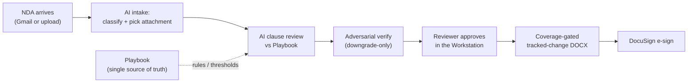

# NDA Review OS — Overview

*Cover page. The detailed sheet (architecture, operations, troubleshooting, rebuild steps) follows this one.*

> An AI contract agent that **reads every NDA a counterparty sends back, redlines it against your playbook, and routes it to signature** — clause by clause, with quoted evidence, a human approval gate, and a faithful tracked-change Word file at the end. No copy-paste, no "which version is final?", no silently dropped redlines.

| | |
|---|---|
| **Product** | NDA Review OS (Aspora NDA Review & Redline Agent) |
| **Status** | Live on Render — continuous deploy from `main` (this sheet is grounded at `cb7346b0`) |
| **Source** | `github.com/daniyalahmadasporalondon/nda-automation` (deploy origin) · prod: `nda-automation.onrender.com` |
| **Stack** | Vanilla-JS SPA (no build step) · Python stdlib HTTP server (no web framework) · JSON matter-store on a persistent disk (no DB) · Claude **Opus 4.8** + DeepSeek via **OpenRouter** · `python-docx` / PyMuPDF / pdf2docx · DocuSign + Gmail |
| **Scope** | Review · Redline · Generate · E-sign — playbook-driven across 5 core clause families (mutuality, confidential information, governing law, term & survival, non-circumvention) and 4 governing-law options (India, Delaware, England & Wales, DIFC) |
| **Owner** | Aspora Team — daniyal.ahmad@aspora.com |

---

## Why it exists

Almost no NDA gets signed as drafted. A counterparty sends one back **already redlined** — names filled in, terms changed, whole clauses inserted with Track Changes on — and someone has to read all of it, decide what's acceptable against company policy, propose counter-edits, and get sign-off before it can be returned. Done by hand it's slow and inconsistent: positions drift between reviewers, evidence lives in someone's head, the "final" file is whichever attachment was emailed last, and a dropped redline isn't noticed until it's been signed.

This product automates the loop without taking the human out of it. An NDA arrives (forwarded to a mailbox or uploaded); the AI assesses **every clause against a configurable playbook**, proposes tracked-change redlines with the exact text it's relying on, a reviewer approves clause by clause, and the system exports a Word document whose redlines are **proven complete** and hands it to DocuSign — owned, tracked, and fully audited.

---

## How it works (at a glance)

**Five ideas hold it together:**

1. **The Playbook is the single source of truth.** Every rule, threshold, and approved option lives in `playbook.json`. The AI *infers, judges, and applies* from it — it never overwrites it. Hardcoded rules elsewhere are treated as bugs ("deterministic ghosts") and removed.
2. **AI-first, adversarially verified.** A strong reviewer proposes verdicts; a second-pass verifier can only **downgrade**, never inflate. A verdict that isn't grounded in quoted document text doesn't stand.
3. **A human approval gate.** Nothing is exported or sent until a reviewer has approved it clause by clause — the live document is never machine-generated and auto-released.
4. **Faithful by construction.** A content-coverage gate proves the exported tracked-change DOCX contains **every word** of the source plus the redlines — so a redline can't be silently dropped or mis-anchored. This is what makes counterparty-pre-redlined NDAs safe to export.
5. **Deterministic where it must be.** NDA generation is fully deterministic (no model call), and the playbook is protected by deterministic structural lint — the AI is used for judgment, not for things that must be exact.

---

## What's been built (summary)

*Each item is detailed — What / Why / How — in the detailed sheet.*

- **Review engine** — AI-first per-clause assessment against the playbook (pass / review / fail + evidence + redline), an adversarial **downgrade-only verifier**, evidence-grounding (ungrounded fails are rejected), explicit polarity / negation handling, and an AI structure-validation overlay.
- **Redline & export** — tracked-change DOCX built from the source document, a **content-coverage integrity gate** that now correctly handles counterparty-pre-redlined, header/footer (letterhead), and tab/carriage-return documents, PDF→DOCX conversion for PDF-source NDAs, and a faithful in-browser render.
- **Playbook** — fully editable with a draft → publish flow, a multi-layer consistency lint (deterministic structural checks + an optional AI-semantic pass), and single-source-of-truth enforcement at the publish gate.
- **Generation** — deterministic NDA generation from company templates + a signing-entity registry, an independent gen-verify gate, and multi-layer prompt-injection defense. The term is entered in **years or months**, converted and capped to the playbook maximum (5 years / 60 months), and the clause is worded "whichever is earlier"; Review carries the same cap as a month-equivalence ("60 months") in the AI packet.
- **Intake & email** — AI intake classification + injection-hardened attachment selection on the Gmail path, and a recipient-confirmation guard that blocks spoofed-Reply-To exfiltration *before* any send. Inbound precision hardening: sender-domain excludes for e-sign-platform/calendar senders, an AI **pre-gate** that only pays for the classifier/selector when a candidate shows real signal (fail-open for extraction-blind, foreign-language, and explicitly-announced NDAs), **executed-NDA capture** from platform completion notifications, reason-stratified quarantine, and a 14-day first-sync backfill cap that widens per poll.
- **E-sign** — DocuSign OAuth + anchor-tab signing wired into the approved-NDA flow. The envelope always signs the **current** reviewed document: the reviewed DOCX is registered eagerly at approval, and for an edited matter send rebuilds it through the coverage-gated path (or raises) — never the un-redlined original or a stale copy.
- **Security & reliability** — fail-closed tenant isolation (ownerless-matter cross-tenant leak fixed), admin gate + CSRF + proxy-aware rate limiting, an optional app-layer Google sign-in allowlist (default-off/inert until configured, then fail-closed), matter-store locking, document-render DoS hardening, and a Render persistent disk that ends session/logout churn.
- **Operations & scale** — off-request corpus load with a `duplicate_scan {pending, complete}` degrade, a 500-event `matter_timeline` cap (dropped from list payloads, kept in detail), a per-record incremental matter-list cache, greppable failure-visibility stdout (verifier / DocuSign-webhook / Drive) + a periodic `telemetry_snapshot`, an admin **bulk-archive** for Gmail noise (dry-run, hash-confirmed, fail-closed), and an admin all-owners backup dump.
- **Workstation UI** — Review Workstation (Redline / Clean / Side-by-side / Original views; Overview / Clause / Structure tabs; per-clause decisions + approval), Repository, Corpus search, Generator, Playbook editor, Admin, and an in-app Guide.

---

## Cost

The only **usage-based** cost is the AI (via OpenRouter). Every AI feature is a **single model call**, and the most expensive one — clause review — is the only one that runs on Opus by default; the rest run on cheap DeepSeek models, and generation uses no model at all.

**Reviewer rates (Opus 4.8):** **$5 per million input tokens, $25 per million output tokens** — the rates the app uses for its own cost logging. *OpenRouter bills its own equivalent; its dashboard is the source of truth for actual spend.* **Rule of thumb:** ~4 characters ≈ 1 token; the review packet is capped (~15k tokens) on top of a ~3k-token cached system prompt.

### Cost per AI operation (typical)

| AI operation | When it runs | Model | ~Input | ~Output | ~Cost / call |
|---|---|---|---|---|---|
| **Clause review** | Review clicked, per matter | Opus 4.8 | 15,000 | 4,000 | **$0.18** |
| **Attachment triage** | inbound email with attachments | Opus 4.8 | 4,000 | 1,000 | **$0.05** |
| **Playbook semantic-lint** | on publish (advisory, opt-in) | Opus 4.8 | 6,000 | 2,000 | **$0.08** |
| **Adversarial verify** | after review, confident clauses | DeepSeek-Pro | 8,000 | 2,000 | **~$0.01** |
| **Structure validation** | after review, per matter | DeepSeek-Flash | 10,000 | 3,000 | **~$0.002** |
| **Intake classify** | per inbound email | DeepSeek-Flash | 3,000 | 1,000 | **~$0.001** |
| **NDA generation** | on generate | *deterministic* | — | — | **$0** |

*Opus cost = input × $5/M + output × $25/M. DeepSeek rows are ~10–50× cheaper and rounded.*

### Rolled up

| Scenario | AI calls | ~Cost |
|---|---|---|
| **One inbound NDA, full pass** (intake + triage + review + verify + structure) | 5 | **~$0.24** |
| **One re-review** of an existing matter (review + verify + structure) | 3 | **~$0.19** |
| **Monthly example** — 200 inbound NDAs reviewed + 50 re-reviews | ~1,150 | **~$58 / month** |

**What lowers it:** our own reviewer bake-offs found **DeepSeek-V4-Pro and GLM 5.2 tie Opus on review quality** (including the hard polarity traps) at roughly **1/8 the cost** — routing the reviewer there drops a full pass from ~$0.24 to **~$0.04** (and the monthly example from ~$58 to **~$10**). Prompt caching bills the ~3k-token system prompt at ~10% on repeat calls, and the verifier/structure/intake steps already run on cheap models.

**Infrastructure:** a Render Standard plan + a 1 GB persistent disk (`/var/data`) for durable matters, sessions, and OAuth tokens — no managed database (state is JSON on the disk, which keeps the system small, auditable, and trivial to rebuild). It can run on Render's free tier for evaluation at $0 (with idle-sleep and ephemeral storage).

> **Estimates, not invoices.** Token counts are typical-case approximations — they scale with document length and how many clauses a document has. The OpenRouter dashboard shows the exact billed amount.

---

## Where the detail lives

The **detailed sheet** covers: full architecture & data model, the complete What / Why / How for every component, environment variables & secrets, Render access, day-to-day operations, troubleshooting, rebuild-from-scratch, and how to make changes.
